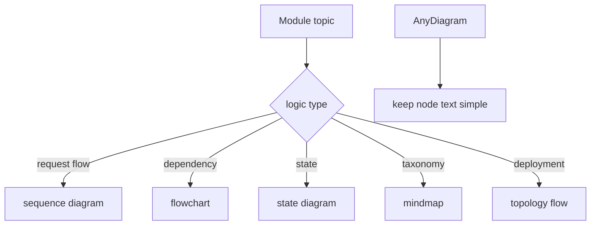

# 352｜可视化风格指南：运行逻辑图绘制规范

<callout emoji="✅">
**本章目标：**统一说明本项目文档中运行逻辑图的表达规范。
</callout>

## 本轮源码校准补充：可视化规范补充

| 图类型 | 使用建议 |
|-|-|
| 学习路线 | 用 flowchart，从 JS 心智到 frontend/Gateway/runtime/agent。 |
| 请求链路 | 用 sequenceDiagram 或 flowchart，节点文字保持短句，避免特殊字符导致 whiteboard parse warning。 |
| 模块分层 | 用表格 + 简短 flowchart，避免 20+ 节点的大图。 |
| 风险/验收 | 用 callout + checklist/table，不要把所有信息都塞进 Mermaid。 |

<callout emoji="💡">
如果 `lark-cli docs +update` 返回 whiteboard parse warning，正文通常仍会写入，但图可能降级或丢失；应 refetch 并专项修图。
</callout>

| 场景 | 推荐图 |
|-|-|
| 请求/响应链路 | sequenceDiagram |
| 模块依赖 | flowchart TD/LR |
| 状态流转 | stateDiagram |
| 分类/层级 | mindmap 或 flowchart |
| 部署拓扑 | flowchart LR |

