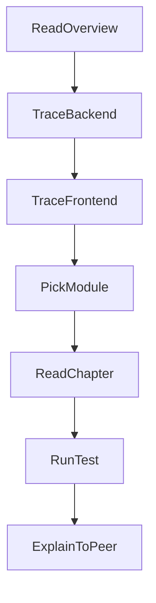

# 353｜新同学源码走读检查清单

<callout emoji="✅">
**本章目标：**给新同学一份可打勾的学习和验收清单。
</callout>

## JS 前端专项验收

<callout emoji="✅">
**验收方式：**不要只背章节号；请用源码路径讲清一条消息从输入框到后端 agent 再回到 UI 的完整链路。
</callout>

- [ ] 能指出 `useThreadChat` 只管理 URL/thread 状态，不负责提交消息。

- [ ] 能画出 `InputBox -> ChatPage.handleSubmit -> useThreadStream.sendMessage -> LangGraph SDK thread.submit -> Gateway -> RunManager -> run_agent -> StreamBridge -> MessageList`。

- [ ] 能解释 `/workspace/chats/new` 为什么先有本地临时 UUID，后续由 `onStart` 替换为真实 thread URL。

- [ ] 能说明 `/api/langgraph/*` 是浏览器/nginx 入口，最终 rewrite 到 Gateway `/api/*`。

- [ ] 能区分上传文件、正式 artifact、`write-file:` 临时 artifact 三条路径。

- [ ] 能按阶段解释 middleware：base runtime middlewares 与 lead-agent additions。

- [ ] 能说出本地验证优先级：前端先 `pnpm check`/`pnpm test`，后端按 `backend/Makefile` 选择定向测试。

## JavaScript 前端同学专项检查清单

- [ ] 能解释 DeerFlow 前端不是普通 chat UI，而是通过 LangGraph SDK 订阅 thread/run stream。

- [ ] 能从 `frontend/src/components/workspace/input-box.tsx` 追到 `use-thread-chat`、`frontend/src/core/threads/*` 和消息渲染组件。

- [ ] 能说明 `NEXT_PUBLIC_LANGGRAPH_BASE_URL`、nginx、Gateway 的 `/api/langgraph/*` 三者关系。

- [ ] 能区分 Gateway router、RunManager、StreamBridge、lead_agent 的职责。

- [ ] 能用 JS 类比解释 middleware：它像请求拦截器/Provider，但处理的是 agent 上下文、工具、安全和持久化。

- [ ] 能说出 ThreadData、Uploads、Sandbox、SkillActivation、Memory、Title、ToolOutputBudget 至少 7 个 middleware 中 5 个的作用。

- [ ] 能根据一个 bug 初步判断应查前端组件、core API、Gateway router、runtime、middleware、model provider、sandbox 还是 skills/MCP/memory。

- [ ] 能选择最小验证命令：前端先 `pnpm check`/`pnpm test`，后端按 `backend/Makefile` 跑相关测试，不盲跑全量 E2E。

- [ ] 能从 00/01 讲清 DeerFlow 分层。

- [ ] 能画出 /api/langgraph 到 lead_agent 的请求链路。

- [ ] 能解释 ThreadData、Uploads、Sandbox、ToolOutputBudget 的职责。

- [ ] 能解释 useThreadStream 如何驱动前端 UI。

- [ ] 能找到某个 router、middleware、frontend component 的对应文档。

- [ ] 能运行 make check / make doctor / backend tests / frontend tests。

