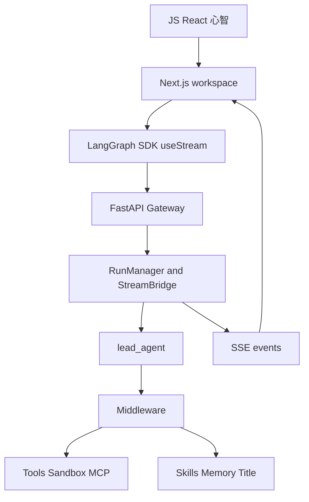
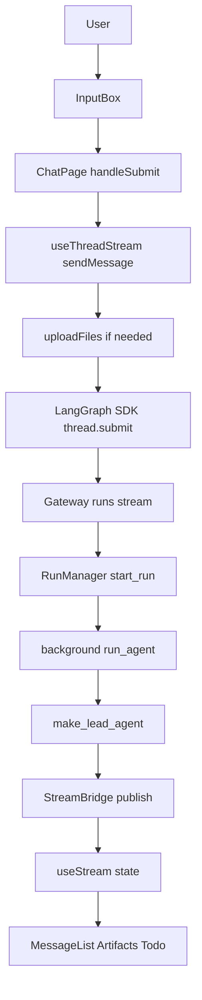
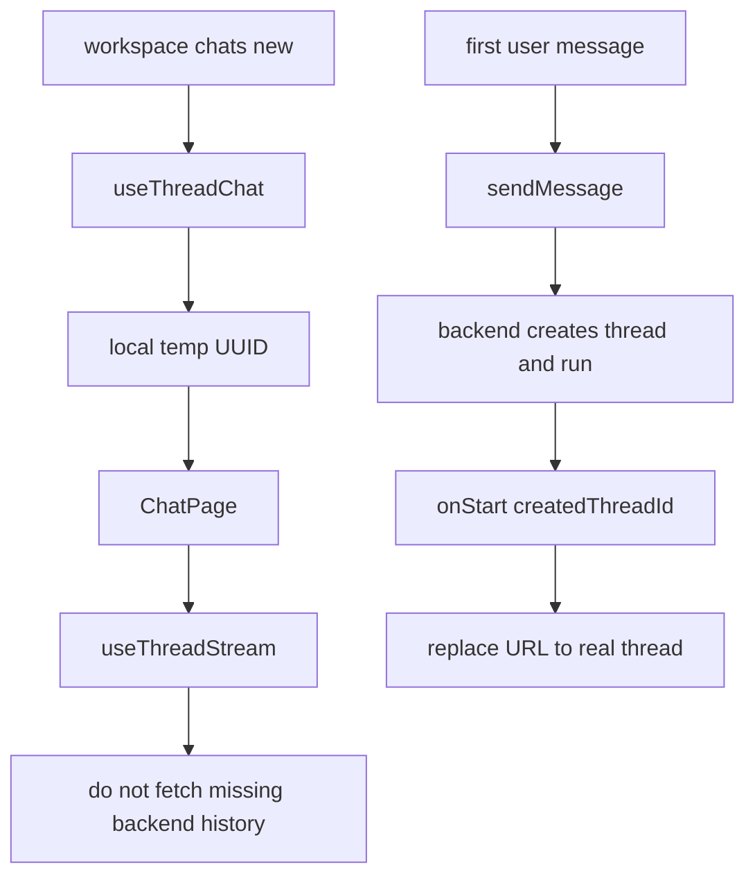
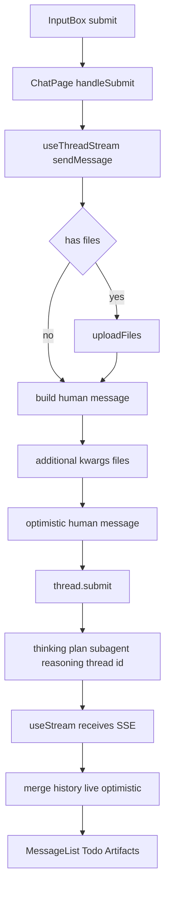
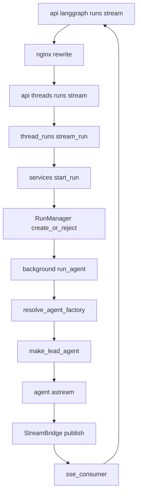

<title>355｜只会 JS 的前端学习 DeerFlow 路线图</title>

<callout emoji="💡">
**读者定位：**你会 JavaScript/React，但不熟 Python、FastAPI、LangGraph、Agent Runtime。本文把 DeerFlow 当成一个 **Next.js App Router / React workspace + Gateway/BFF + Agent Runtime** 来读：先用前端心智建立地图，再沿着一条真实消息链路进入后端。
</callout>

---

# 0. 先把 DeerFlow 翻译成前端能理解的语言

| DeerFlow 概念 | 前端类比 | 深入时要修正的点 |
|-|-|-|
| `frontend/` | Next.js App Router + React workspace | 不只是 UI：它通过 LangGraph SDK 订阅 thread/run stream，并渲染 message、artifact、todo、subtask。 |
| `backend/app/gateway/` | BFF / API Routes / Node 服务层 | 这里用 Python FastAPI 写，承接认证、上传、线程、run、模型、skills、memory、artifacts 等 API。 |
| `/api/langgraph/*` | 浏览器侧 chat/run streaming API | nginx 会把它 rewrite 到 Gateway 的 `/api/*`；不是单独的 LangGraph 服务。 |
| `RunManager` | 后台任务管理器 | 创建 run、拒绝/中断冲突 run、记录状态、对接后台 worker。 |
| `StreamBridge` | EventEmitter + SSE buffer | 后台 worker publish 事件，HTTP SSE consumer 读事件并发回前端。 |
| `lead_agent` | 会调用工具的业务编排器 | 由 model、prompt、tools、middleware、state schema 组成。 |
| Middleware | 请求拦截器 / Provider / Express middleware | 处理 agent 上下文、线程目录、上传文件、sandbox、skills、memory、title、token usage、安全等横切逻辑。 |
| Sandbox | iframe / Web Worker / 临时 workspace | 隔离 agent 可读写的线程文件系统和命令执行环境。 |

---

# 1. 最短主线：从输入框追到后端再回到 MessageList

<callout emoji="✅">
**先记住正确链路：**不是 `use-thread-chat` 提交消息。真实提交链路是 `InputBox -> ChatPage.handleSubmit -> useThreadStream.sendMessage -> LangGraph SDK thread.submit -> Gateway stream route -> RunManager/run_agent -> StreamBridge -> useStream state -> MessageList`。
</callout>

| 步骤 | 关键文件 | 你要读懂什么 |
|-|-|-|
| 页面装配 | `frontend/src/app/workspace/chats/[thread_id]/page.tsx` | ChatPage 组合 `useThreadChat`、`useThreadSettings`、`useThreadStream`、`MessageList`、`InputBox`、`ArtifactTrigger`、`TodoList`。 |
| 路由状态 | `frontend/src/components/workspace/chats/use-thread-chat.ts` | 只负责从 URL 派生 `threadId`、`isNewThread`、`isMock`，并处理 `/new` 的临时 UUID；不负责提交消息。 |
| 输入框 | `frontend/src/components/workspace/input-box.tsx` | 校验文本/文件、stop streaming、模型自动选择，最后触发 `onSubmit`。 |
| stream hook | `frontend/src/core/threads/hooks.ts` | `useThreadStream` 创建 LangGraph SDK `useStream`，并在 `sendMessage` 中上传文件、创建 optimistic messages、调用 `thread.submit`。 |
| SDK client | `frontend/src/core/api/api-client.ts`、`frontend/src/core/config/index.ts` | `getLangGraphBaseURL()` 默认是浏览器当前 origin 的 `/api/langgraph`；mock 模式走 `/mock/api`。 |
| Gateway stream | `backend/app/gateway/routers/thread_runs.py` | `POST /api/threads/{thread_id}/runs/stream` 创建 run 并返回 SSE。 |
| run service | `backend/app/gateway/services.py` | `start_run()` 校验模型/权限、构造 config/context、调 `RunManager.create_or_reject()` 并启动后台 task。 |
| runtime worker | `backend/packages/harness/deerflow/runtime/runs/worker.py` | `run_agent()` 发布 metadata，构造 Runtime，调用 agent `astream`，把事件发给 StreamBridge。 |
| agent factory | `backend/packages/harness/deerflow/agents/lead_agent/agent.py` | `make_lead_agent()` 组装模型、prompt、tools、middleware、skills、state schema。 |

---

# 2. `/workspace/chats/new` 生命周期

| 关键点 | 说明 |
|-|-|
| 临时 ID | `/new` 页面会生成一个本地 UUID，用于 UI 展示和乐观状态。 |
| 不提前拉 history | `isNewThread` 为 true 时，`useThreadStream` 会避免把临时 ID 当作真实后端 thread 拉历史。 |
| `onSend` | 主要让欢迎页布局切换，不等于真实后端 thread 已创建。 |
| `onStart` | 后端 run 创建后拿到真实 `createdThreadId`，ChatPage 用 `history.replaceState` 把 URL 替换为 `/workspace/chats/{id}`。 |
| Next.js caveat | `replaceState` 不一定立刻刷新 `useParams`，所以 `useThreadChat` 有保护逻辑，避免继续传播 `new` 作为真实 thread id。 |

---

# 3. `sendMessage` 内部流程

| 步骤 | 重点 |
|-|-|
| 输入校验 | 文本、文件、停止 streaming、模型自动选择。 |
| 文件上传 | 文件先上传到 Gateway，再把上传结果写进 human message metadata。 |
| SDK 提交 | `thread.submit(...)` 发送 messages、stream options、recursion limit 和 context。 |
| context 字段 | 包含 `thinking_enabled`、`is_plan_mode`、`subagent_enabled`、`reasoning_effort`、`thread_id`。 |
| UI 合并 | 合并 history、live thread messages、optimistic messages，并按 identity 去重。 |

---

# 4. Gateway / Runtime：从 HTTP 到 agent 的真实路径

| 后端对象 | 职责 | 前端类比 |
|-|-|-|
| `thread_runs.stream_run` | HTTP handler，创建 run 并返回 SSE。 | API route handler。 |
| `services.start_run` | 校验请求、构造 config/context、启动后台任务。 | service layer。 |
| `RunManager` | run 状态机：create/reject/interrupt/rollback/status/history。 | task manager / job store。 |
| `run_agent` | 后台执行 agent，发布 metadata、values、messages、custom events。 | background promise / worker。 |
| `StreamBridge` | 保存短期事件、支持 replay/heartbeat/end sentinel。 | EventEmitter + SSE buffer。 |
| `make_lead_agent` | 读取配置并创建带 middleware/tools/prompt 的 agent。 | app factory / dependency injection。 |

---

# 5. Middleware 按阶段理解

| 阶段 | 代表 middleware | 作用 |
|-|-|-|
| 基础运行环境 | ToolOutputBudget、ThreadData、Uploads、Sandbox | 准备工具输出预算、线程目录、上传文件上下文、sandbox。 |
| 工具安全与错误 | DanglingToolCall、LLMErrorHandling、SandboxAudit、ToolErrorHandling | 修复/拦截异常工具调用、审计 sandbox、规范错误返回。 |
| lead agent 上下文 | DynamicContext、SkillActivation、Summarization、Todo、TokenUsage | 注入动态上下文、激活 skill、压缩上下文、计划模式、token 用量。 |
| 副作用与安全结束 | Title、Memory、DeferredToolFilter、Loop/Safety、Clarification | 标题、长期记忆、延迟工具、循环/安全结束、澄清中断。 |

---

# 6. Artifacts / Uploads：三条路径不要混淆

| 类型 | 来源 | 前端展示 |
|-|-|-|
| 上传文件 | 用户通过 InputBox 添加，先走 Gateway uploads。 | 作为 message file metadata 和后端上下文。 |
| 正式 artifact | agent 显式 present files 或状态里出现 `thread.values.artifacts`。 | Artifact panel / `ArtifactFileList` / `ArtifactFileDetail`。 |
| `write-file:` 临时 artifact | 当前 tool-call/message 中的写文件过程。 | 可在 UI 中预览，但不等于已经有稳定 Gateway artifact URL。 |

---

# 7. 三天学习计划

| 天数 | 目标 | 阅读文档 | 源码练习 | 验收 |
|-|-|-|-|-|
| Day 1 | 只看前端，把 UI/stream 心智跑通。 | 06、42、50、58、100、112、129、355 | 追 `InputBox -> ChatPage.handleSubmit -> useThreadStream.sendMessage -> MessageList`。 | 能说清 loading、optimistic、stream update、artifact trigger 谁负责。 |
| Day 2 | 把前端请求接到 Gateway。 | 02、11、21、51、52、64、65、349 | 从 `getLangGraphBaseURL()` 追到 nginx rewrite 和 `thread_runs.stream_run`。 | 能区分 `/api/langgraph/*` 与普通 `/api/*`。 |
| Day 3 | 理解 agent runtime 闭环。 | 03、04、05、12、13、19-36、253-267 | 画 `RunManager -> run_agent -> make_lead_agent -> middleware -> StreamBridge`。 | 能解释至少 5 个 middleware 的职责和顺序影响。 |

---

# 8. 学完后的自测问题

- [ ] 我能解释 DeerFlow 为什么是 `Frontend + Gateway + Agent Runtime + Skills/MCP/Memory/Sandbox`。

- [ ] 我能从输入框追踪到一次 `/api/langgraph/*` streaming 请求，并指出真实提交函数在哪里。

- [ ] 我能说明 `/workspace/chats/new` 为什么先有本地临时 UUID，后续由 `onStart` 替换为真实 thread URL。

- [ ] 我能区分 `useThreadChat`、`useThreadStream`、`MessageList`、`ArtifactsProvider` 的职责。

- [ ] 我能解释 `RunManager` 和 `StreamBridge` 的区别。

- [ ] 我能说清至少 5 个 middleware 的职责和顺序影响。

- [ ] 我能判断一个 bug 应先查 frontend、Gateway router、runtime worker、middleware、model provider、sandbox 还是 skills/MCP/memory。

<readonly-block type="isv"></readonly-block>