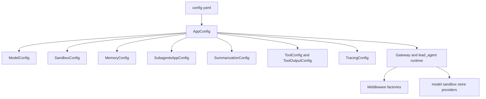
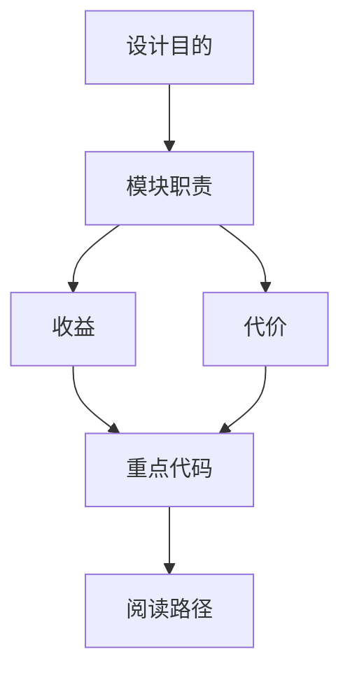

<title>44｜Config 配置类目录详解</title>

<callout emoji="✅">
**本章目标：**把 config 包中各配置类按领域归类，说明它们如何进入 AppConfig 和运行时。
</callout>

| 配置类/文件 | 职责 |
|-|-|
| `model_config.py` | 模型 provider、API 参数、thinking/vision 能力声明。 |
| `sandbox_config.py` | sandbox provider、mounts、allow_host_bash。 |
| `subagents_config.py` | 内置/自定义 subagent override。 |
| `summarization_config.py` | 摘要触发、保留策略、summary prompt。 |
| `tool_output_config.py` | 工具输出预算阈值。 |
| `tool_search_config.py` | deferred tool search 开关。 |
| `tracing_config.py` | LangSmith/Langfuse tracing。 |
| `run_events_config.py` | run events 存储配置。 |

---

# 补充：设计取舍、重点代码与阅读路径

<callout emoji="💡">
**设计目的：**这个模块单独成章，是为了把职责边界、运行逻辑和维护入口从大系统里抽出来。
</callout>

| 维度 | 说明 |
|-|-|
| 收益 | 收益是查找和学习更快，职责更聚焦。 |
| 代价 | 代价是章节数量增加，需要依赖目录和索引维护。 |
| 重点代码 | 重点代码见本章表格列出的源码路径。 |
| 阅读路径 | 阅读路径：先确认它在系统链路中的上游和下游，再看关键函数。 |

