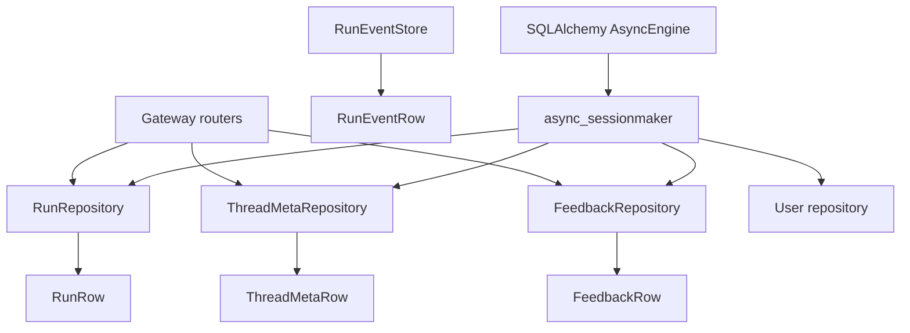
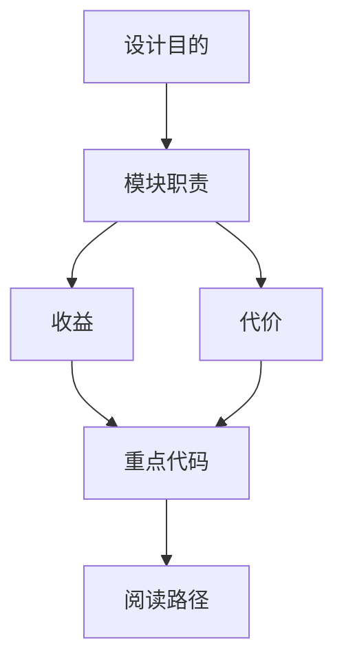

<title>46｜Persistence Repository 文件详解</title>

<callout emoji="✅">
**本章目标：**把 run/thread_meta/feedback/user/run_event 持久化表与 repository 职责讲清。
</callout>

| 模块 | 文件 | 职责 |
|-|-|-|
| Run | `persistence/run/model.py`、`sql.py` | RunRow 和 RunRepository。 |
| ThreadMeta | `persistence/thread_meta/model.py`、`sql.py` | 线程标题、状态、metadata、搜索。 |
| Feedback | `persistence/feedback/model.py`、`sql.py` | run feedback CRUD 和统计。 |
| User | `persistence/user/model.py` | 本地用户表。 |
| RunEvent | `persistence/models/run_event.py` | run event / message event 持久化。 |

---

# 补充：设计取舍、重点代码与阅读路径

<callout emoji="💡">
**设计目的：**该文档用于把模块职责、运行逻辑、关键代码和阅读路径固定下来，帮助读者从源码验证行为。
</callout>

| 维度 | 说明 |
|-|-|
| 收益 | 读者可以按文档快速定位模块入口和上下游关系。 |
| 代价 | 文档需要随源码变更持续校准，避免模板化描述掩盖真实行为。 |
| 重点代码 | 标题对应的源码、测试或文档入口。 |
| 阅读路径 | 先看上游输入，再看核心函数，最后看下游输出和测试验证。 |

