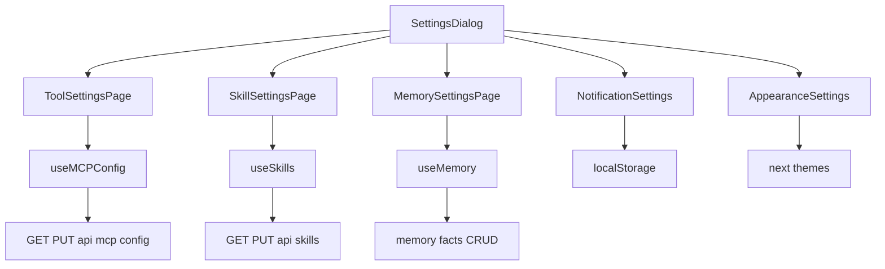
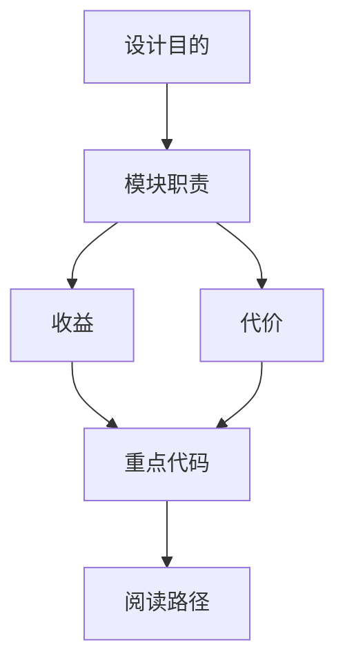

<title>47｜Frontend Settings 页面文件详解</title>

<callout emoji="✅">
**本章目标：**把 SettingsDialog 和各 settings page 的职责、数据来源和 mutation 流程讲清。
</callout>

| 页面文件 | 职责 | 数据源 |
|-|-|-|
| `settings-dialog.tsx` | 设置弹窗总入口和 section 切换 | local UI state |
| `tool-settings-page.tsx` | MCP server 列表和 enabled 开关 | `/api/mcp/config` |
| `skill-settings-page.tsx` | skills 列表、启停、创建 skill 入口 | `/api/skills` |
| `memory-settings-page.tsx` | memory summaries/facts、CRUD、导入导出 | `/api/memory` |
| `notification-settings-page.tsx` | 通知偏好 | localStorage |
| `appearance-settings-page.tsx` | 主题外观 | localStorage/theme |

---

# 补充：设计取舍、重点代码与阅读路径

<callout emoji="💡">
**设计目的：**Settings 页面把本地偏好、MCP、Skills、Memory 等配置入口集中在一个弹窗里，是为了让 workspace 主链路保持简洁，同时把不同数据源的查询与 mutation 分散到对应 core hooks。
</callout>

| 维度 | 说明 |
|-|-|
| 收益 | 设置入口统一，页面组件只消费 hooks 暴露的状态和 mutation。 |
| 代价 | 同一个弹窗同时跨 React Query、localStorage、theme provider 和多个后端管理 API。 |
| 重点代码 | `frontend/src/components/workspace/settings/`、`frontend/src/core/mcp/`、`frontend/src/core/skills/`、`frontend/src/core/memory/`、`frontend/src/core/settings/`。 |
| 阅读路径 | 先看 `settings-dialog.tsx` 的 section 切换，再分别追 tool/skill/memory page 到对应 core hook 和 API。 |

