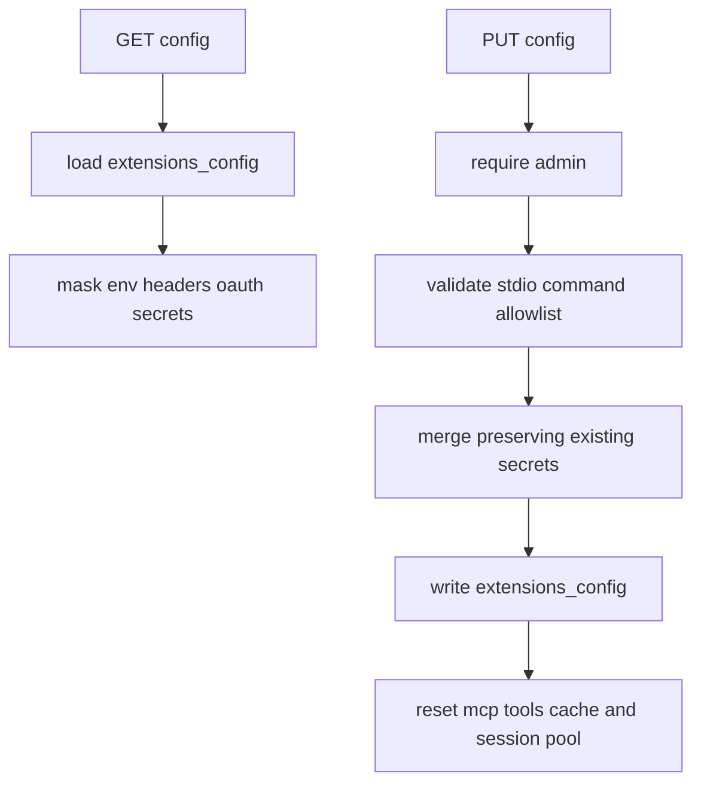
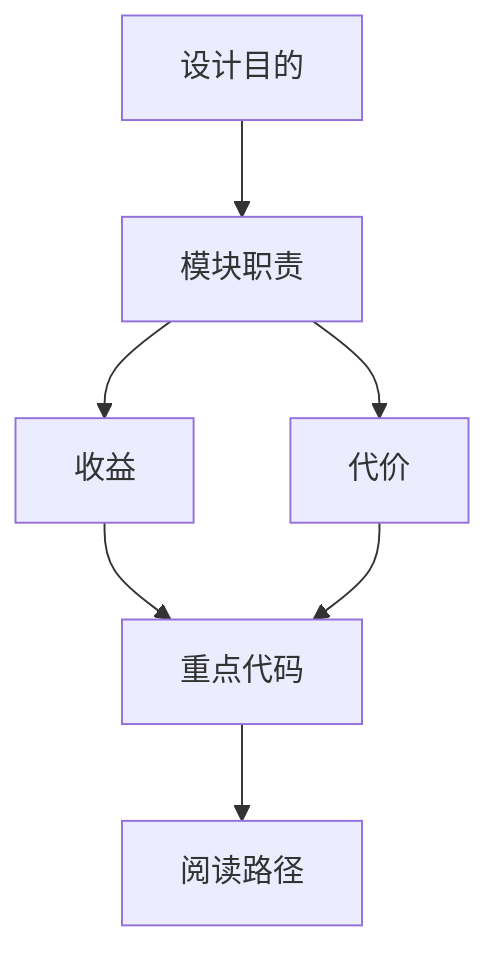
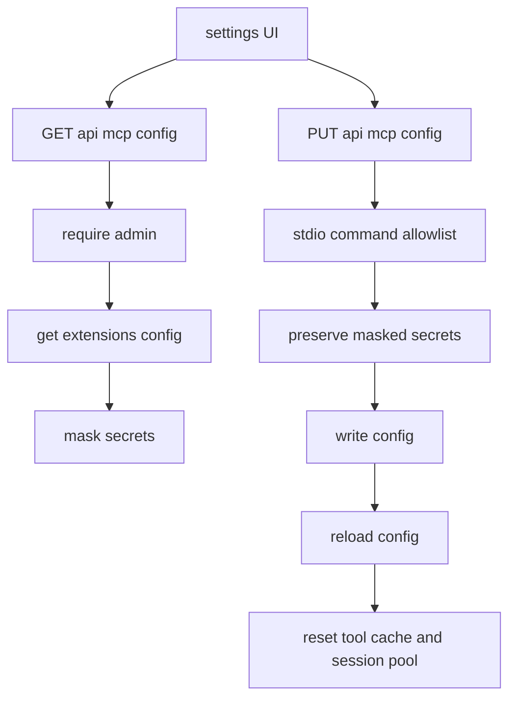

<title>57｜mcp.py Router 单文件详解</title>

<callout emoji="✅">
**本章目标：**单独讲清 mcp.py 的接口职责、数据流和修改风险。
</callout>

# 1. 接口职责

| 接口 | 职责 |
|-|-|
| `GET /api/mcp/config` | 返回 masked MCP config。 |
| `PUT /api/mcp/config` | 更新 MCP config。 |
| 校验 | stdio command allowlist、shell metachar reject。 |
| 保密 | 保留旧 secret，响应 mask。 |

# 2. 运行逻辑图

# 3. 修改建议

- 先改 Pydantic request/response，再改 handler。
- 涉及用户数据必须确认 owner check 或 current user。
- 前端调用方要同步更新 core API/hook。

---

# 补充：设计取舍、重点代码与阅读路径

<callout emoji="💡">
**设计目的：**MCP config router 是受信任管理边界，用来让管理员查看/更新 MCP server 配置，同时避免把 secret 明文回传给浏览器。
</callout>

| 维度 | 说明 |
|-|-|
| 收益 | GET 响应统一 mask env/header/OAuth secret；PUT 可 round-trip masked 值并保留磁盘上的真实 secret。 |
| 代价 | HTTP API 只接受受限 stdio command；本地配置仍可表达更高级配置，因此要区分 API 边界和本地配置能力。 |
| 重点代码 | `backend/app/gateway/routers/mcp.py`、`deerflow.config.extensions_config`、`deerflow.mcp.tools`。 |
| 阅读路径 | 先看 `_require_admin_user`，再看 `_validate_mcp_update_request`、`_merge_preserving_secrets`，最后看 PUT 后 reload/reset MCP cache 的路径。 |

