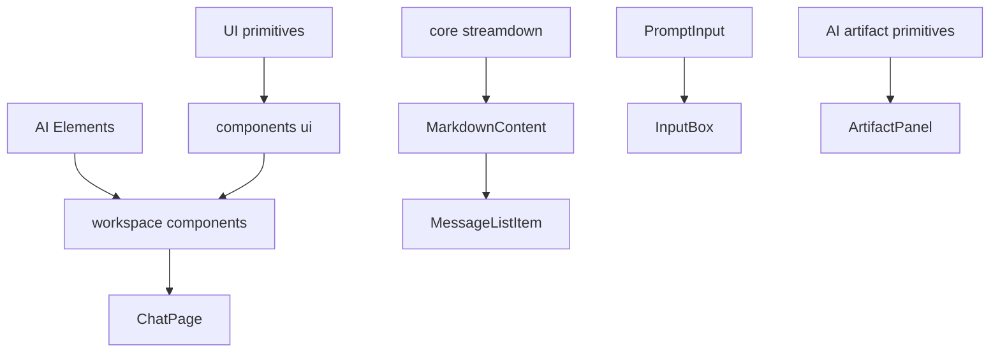

<title>74｜Frontend AI Elements 与 UI 基础组件详解</title>

<callout emoji="✅">
**本章目标：**讲清 ai-elements 与 workspace UI 基础组件如何支撑聊天体验。
</callout>

# 1. 模块职责

| 模块 | 说明 |
|-|-|
| ai-elements | message、conversation、prompt-input、artifact、reasoning、task、sources 等 AI UI primitive。 |
| ui components | button、dialog、sidebar、scroll-area、select 等 shadcn/radix 风格组件。 |
| workspace components | 在 ai-elements 和 ui 基础上组合业务 UI。 |
| streamdown | Markdown、Mermaid、KaTeX、代码高亮渲染。 |

# 2. 运行逻辑图

