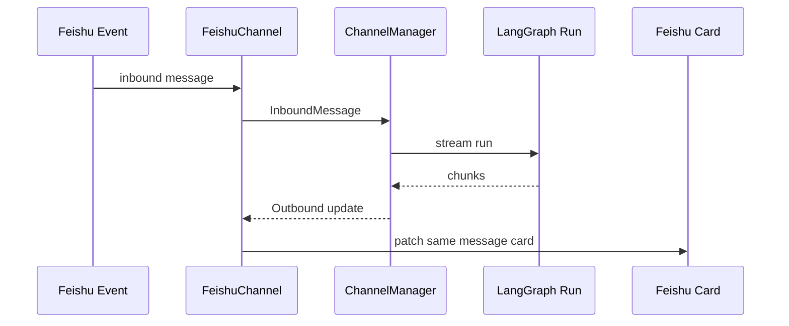

# 75｜FeishuChannel 单文件详解

<callout emoji="✅">
**本章目标：**单独讲清飞书渠道如何收消息、开 run、流式更新卡片。
</callout>

| 模块点 | 说明 |
|-|-|
| 命令识别 | `_is_feishu_command` 判断飞书命令。 |
| Channel 类 | `FeishuChannel` 连接飞书 WebSocket/事件。 |
| 消息更新 | 运行中更新同一张 in-thread card。 |
| 反应流 | 保留 OK/DONE reaction 语义。 |

