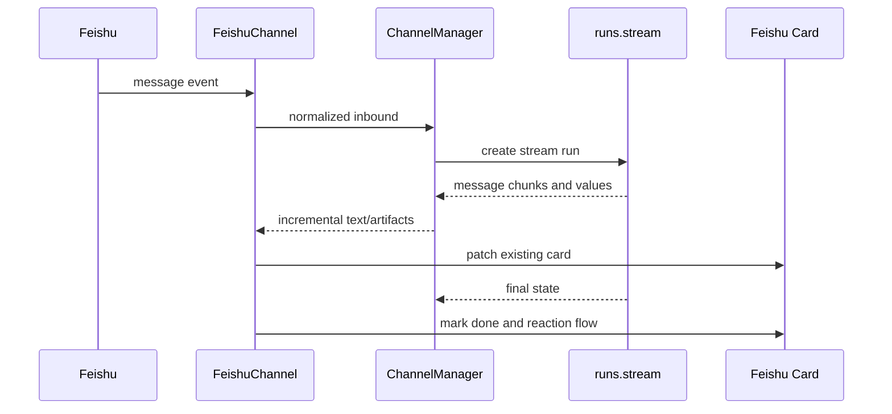

# 85｜Feishu Channel 深入运行逻辑

<callout emoji="✅">
**本章目标：**进一步细化 Feishu channel 的卡片更新、reaction 和 thread 映射。
</callout>

| 模块点 | 说明 |
|-|-|
| 入口 | Feishu event -> FeishuChannel -> ChannelManager。 |
| 命令 | 识别内置命令和 slash skill。 |
| 运行 | Feishu 采用 runs.stream，边生成边更新卡片。 |
| 状态 | 保存 running card message_id，直到 run 完成。 |
| 交互 | OK/DONE reaction 流程保持。 |

