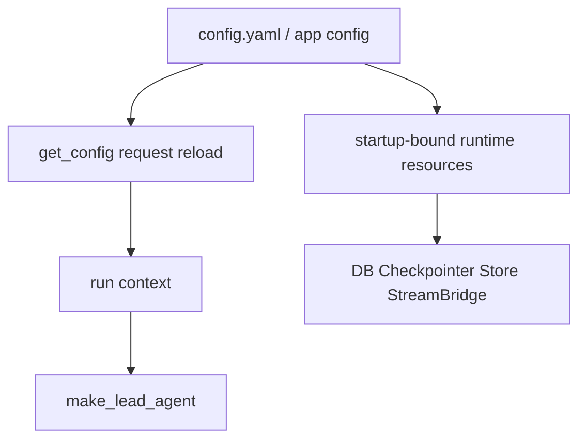
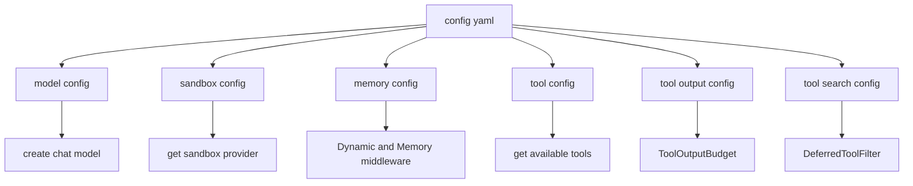
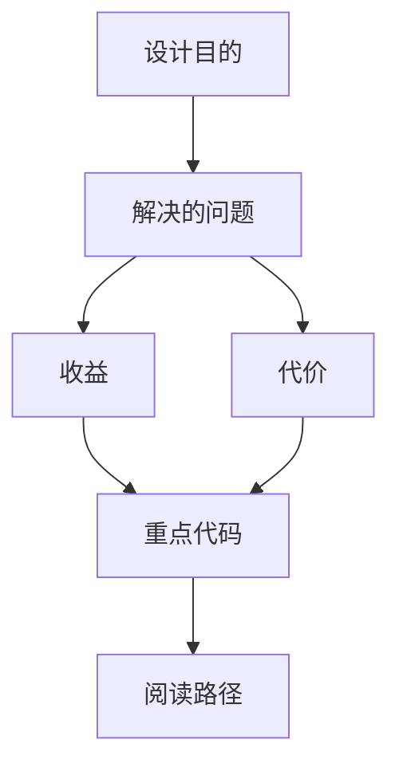

<title>88｜Model/Sandbox/Memory/Tool Config 单文件详解</title>

<callout emoji="✅">
**本章目标：**把常用配置文件进一步单独说明。
</callout>

## 本轮源码校准补充：Model/Sandbox/Memory/Tool Config

| 配置域 | 学习重点 |
|-|-|
| model config | 模型名称、provider、thinking/reasoning 能力、vision 支持会影响 `make_lead_agent`。 |
| sandbox config | provider、mounts、bash/file-write 能力决定工具可用边界。 |
| memory config | 决定 memory 是否启用、存储位置、token counting/warm-up 行为。 |
| tool config | 控制内置工具、community tools、deferred/tool search 等是否可用。 |

| 模块点 | 说明 |
|-|-|
| model_config.py | 模型名称、provider class path、API 参数、能力开关。 |
| sandbox_config.py | provider use、mounts、host bash。 |
| memory_config.py | memory enabled、storage、injection、token 计数。 |
| tool_config.py | 工具组配置。 |
| tool_output_config.py | 工具输出预算。 |
| tool_search_config.py | deferred tool search。 |

---

# 补充：设计取舍、重点代码与阅读路径

<callout emoji="💡">
**设计目的：**这些 config 文件把模型能力、sandbox 执行边界、memory 注入和工具选择从业务代码中抽离出来，让同一 agent runtime 可按部署环境重组。
</callout>

| 维度 | 说明 |
|-|-|
| 收益 | 模型、sandbox、memory、tool provider 可以通过配置切换；run-time 配置通常在请求/agent 装配时读取。 |
| 代价 | 字段会进入不同生命周期：模型和工具多在 run 装配读取，sandbox provider/cache 与部分存储资源可能需要重启或重新初始化。 |
| 重点代码 | `backend/packages/harness/deerflow/config/model_config.py`、`sandbox_config.py`、`memory_config.py`、`tool_config.py`、`tool_output_config.py`、`tool_search_config.py`。 |
| 阅读路径 | 先看 config model 字段，再追踪 `create_chat_model`、`get_sandbox_provider`、Memory middleware、`get_available_tools` 和对应 middleware。 |

