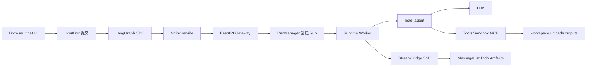
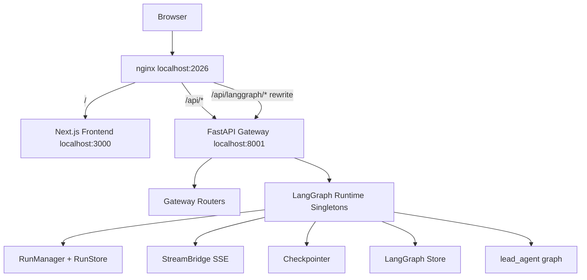
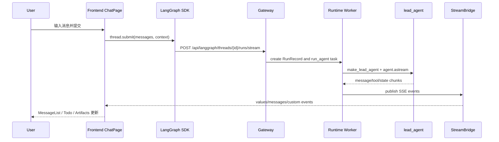
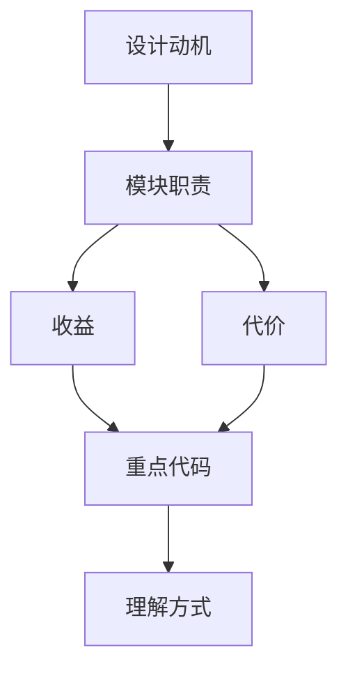

<title>01｜DeerFlow 整体架构与分层总览</title>

<callout emoji="✅">
**核心结论：** DeerFlow 2.0 的默认运行形态是“Frontend + Gateway 内嵌 LangGraph Runtime + lead_agent”。不要把它理解成单独的 LangGraph Server。
</callout>

---

# 可视化增强：跨层数据流总览

<callout emoji="💡">
**图解目标：**在已有分层图之外补一张读者视角的数据流图，直接看到用户消息如何穿过前端、网关、运行时和工具系统。
</callout>

## 1. 用户消息端到端数据流

| 读图对象 | 图里怎么看 | 维护入口 |
|-|-|-|
| 模块职责 | 每一层只承担一个边界职责，图中箭头就是排障顺序 | nginx、gateway/app.py、runtime、lead_agent |
| 数据流 | 输入从左到右，输出再通过 StreamBridge 回前端 | services.py、worker.py、useThreadStream |
| 阅读路径 | 先看入口，再看 run，再看 agent/tools，再看前端消费 | 01→02→03→04→06 |

# 1. 分层职责

| 分层 | 职责 | 关键路径 |
|-|-|-|
| Browser / Frontend | Next.js App Router、workspace chat、settings、artifacts 面板 | `frontend/src/app、frontend/src/components/workspace、frontend/src/core` |
| Nginx | 统一入口和 /api/langgraph rewrite | `docker/nginx/nginx.local.conf、docker/nginx/nginx.conf` |
| Gateway API | REST + LangGraph-compatible API；初始化运行时单例 | `backend/app/gateway/app.py、deps.py、routers/*` |
| Run Runtime | RunManager、StreamBridge、checkpointer、store、journal | `backend/packages/harness/deerflow/runtime/*` |
| Lead Agent | 模型、工具、skills、middleware、prompt 组装 | `backend/packages/harness/deerflow/agents/lead_agent/*` |
| Execution Extensions | sandbox、MCP、skills、memory、uploads/artifacts | `sandbox/*、mcp/*、skills/*、agents/memory/*、uploads/*` |

# 2. 请求入口与服务拓扑

# 3. 一次用户消息的跨层流转

# 4. 新同学阅读检查点

- [ ] 能解释 nginx 将 `/api/langgraph/*` rewrite 到 Gateway 的原因。

- [ ] 能说清 Gateway lifespan 初始化了哪些 runtime singleton。

- [ ] 能把 Frontend、Gateway、Runtime、lead_agent、Tools 的关系画出来。

---

# 补充：设计取舍、重点代码与阅读路径

<callout emoji="💡">
**设计目的：**分层架构把 Browser、Nginx、Gateway、Runtime、Agent、Tools 拆开，是为了让运行边界清晰。
</callout>

| 维度 | 说明 |
|-|-|
| 收益 | 收益是定位问题时能按层排查；代价是跨层链路长，新人容易只看局部。 |
| 代价 | 见收益说明中的代价部分；此章节采用收益与代价合并描述。 |
| 重点代码 | 重点代码：`/Users/bytedance/deer-flow/docker/nginx/nginx.local.conf`、`/Users/bytedance/deer-flow/backend/app/gateway/app.py`、`/Users/bytedance/deer-flow/backend/packages/harness/deerflow/agents/lead_agent/agent.py`。 |
| 阅读路径 | 阅读路径：把它看成一条请求流水线，而不是一组目录。 |

