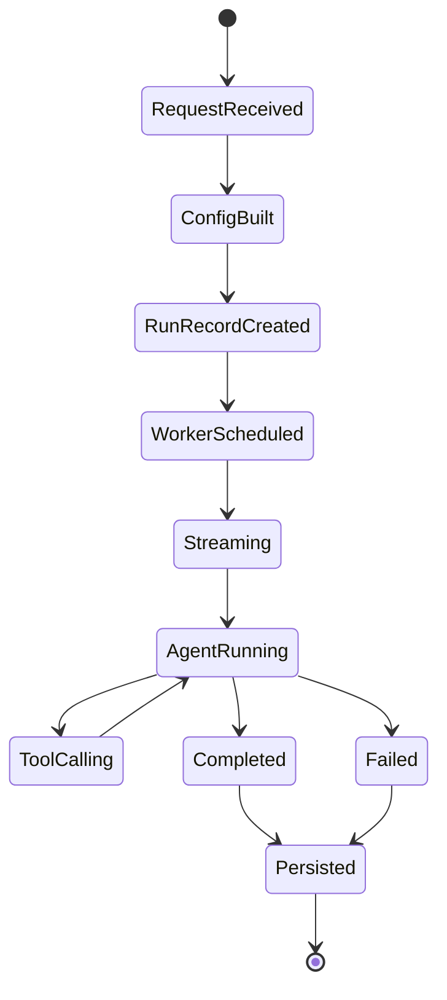
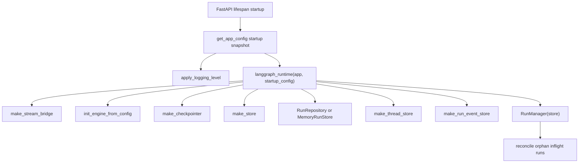
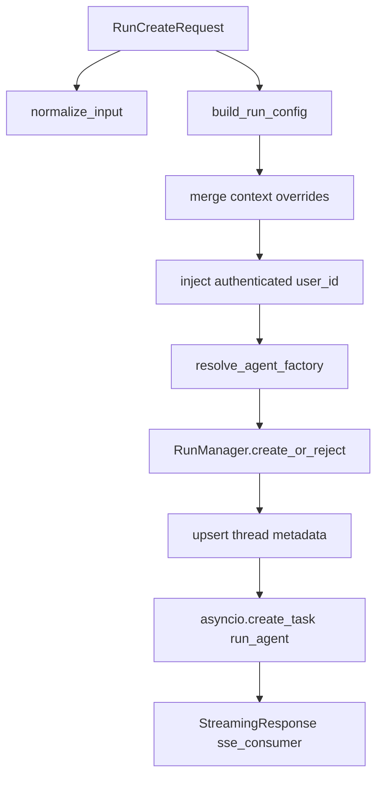
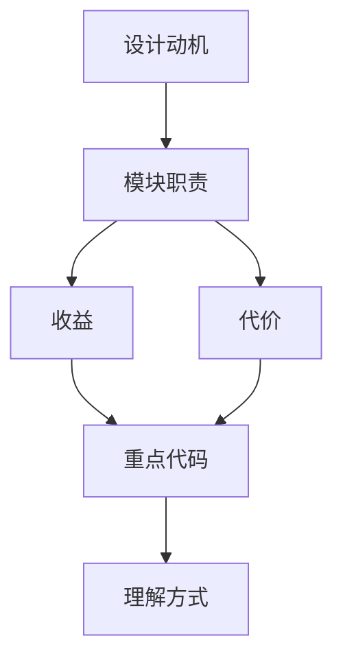

<title>02｜Gateway 与 LangGraph 运行时详解</title>

<callout emoji="✅">
**本章目标：** 从 HTTP 请求进入 Gateway 开始，讲清 run 如何被创建、如何后台执行、如何通过 SSE 回到前端。
</callout>

---

# 可视化增强：Run 生命周期状态图

<callout emoji="💡">
**图解目标：**补充 run 从请求到结束的状态流，让读者用一张图理解 create、stream、worker、store、end 的关系。
</callout>

## 1. Run 生命周期状态流



| 读图对象 | 图里怎么看 | 维护入口 |
|-|-|-|
| 模块职责 | Gateway 负责接请求和建 run，worker 负责真实执行 | services.py、thread_runs.py、worker.py |
| 数据流 | RunRecord 与 SSE 事件并行推进，最终落到 store/event store | RunManager、StreamBridge、RunEventStore |
| 风险点 | 中断、孤儿 run、SSE 断连要分别看不同状态 | deps.py、services.py、runtime/runs |

# 1. Gateway 模块地图

| 文件/模块 | 职责 | 重点函数 |
|-|-|-|
| `app.py` | FastAPI app、lifespan、middleware、router 注册 | create_app、lifespan、\_ensure_admin_user |
| `deps.py` | 运行时单例初始化和依赖获取 | langgraph_runtime、get_run_context、get_config |
| `services.py` | run lifecycle 业务层 | start_run、build_run_config、sse_consumer |
| `thread_runs.py` | thread scoped runs API | create_run、stream_run、wait_run、join |
| `runs.py` | stateless runs API | stateless_stream、stateless_wait |
| `threads.py` | thread CRUD/state/history | create/search/get state/history/delete |
| `models/mcp/skills/memory/uploads/artifacts routers` | 管理 API | 前端 settings 和 artifact 面板调用 |

# 2. Runtime 初始化逻辑



# 3. start_run 细节



# 4. SSE 消费逻辑

`services.py::sse_consumer` 订阅 `StreamBridge`。后台 `run_agent` 发布 values、messages、custom、metadata、end 等事件；前端 LangGraph SDK 消费这些事件并驱动 UI。

```http
POST /api/langgraph/threads/{thread_id}/runs/stream
# nginx rewrite -> /api/threads/{thread_id}/runs/stream
# router -> services.start_run -> runtime.runs.worker.run_agent
```

# 5. 修改建议

- 改 API 形状：先看 router 的 Pydantic model，再看 `services.py` 是否需要同步。
- 改运行时生命周期：先看 `deps.py::langgraph_runtime`，确认是否属于 startup-only 配置。
- 改 SSE：同时检查后端 `format_sse/sse_consumer` 和前端 `useThreadStream` 回调。

---

# 补充：设计取舍、重点代码与阅读路径

<callout emoji="💡">
**设计目的：**Gateway 内嵌 LangGraph runtime，是为了减少独立 LangGraph Server 部署复杂度，同时保留兼容 API。
</callout>

| 维度 | 说明 |
|-|-|
| 收益 | 收益是部署简单、状态统一；代价是 Gateway 进程职责更重，启动期单例边界更重要。 |
| 代价 | 见收益说明中的代价部分；此章节采用收益与代价合并描述。 |
| 重点代码 | 重点代码：`/Users/bytedance/deer-flow/backend/app/gateway/services.py`、`/Users/bytedance/deer-flow/backend/app/gateway/deps.py`、`/Users/bytedance/deer-flow/backend/packages/harness/deerflow/runtime/runs/worker.py`。 |
| 阅读路径 | 阅读路径：router 只接请求，services 建 run，worker 真执行。 |

