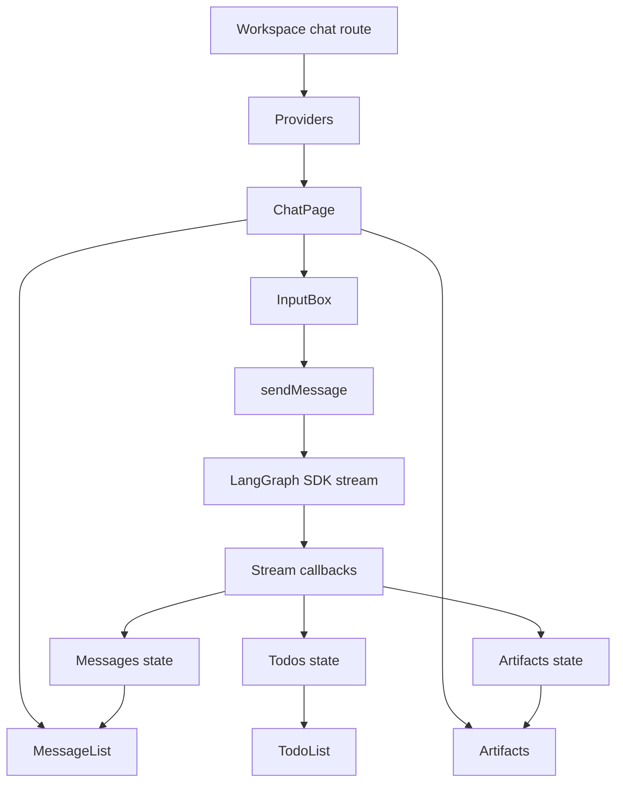
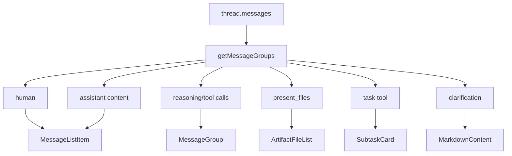
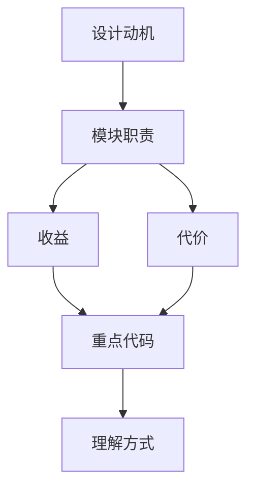

<title>06｜Frontend Workspace 与 Chat 主链路详解</title>

<callout emoji="✅">
**本章目标：** 从 Next.js route 到 LangGraph SDK streaming，讲清用户打开 /workspace/chats/new、发送消息、看到结果的全过程。
</callout>

---

# 可视化增强：前端状态消费图

<callout emoji="💡">
**图解目标：**补齐 workspace 从输入到状态更新的 UI 数据流，帮助读者把 hook、callback、组件对上。
</callout>

## 1. Frontend Chat 状态消费图

| 读图对象 | 图里怎么看 | 维护入口 |
|-|-|-|
| 模块职责 | route 负责装配，hook 负责流式状态，组件负责展示 | workspace chats page |
| 数据流 | SDK callbacks 把后端事件拆成 messages、todos、artifacts | useThreadStream、core threads |
| 阅读路径 | 先看 ChatPage，再看 sendMessage，再看 MessageList 与 Artifacts | 06 章节 |

# 1. Workspace 壳层

| 文件 | 职责 |
|-|-|
| `frontend/src/app/workspace/layout.tsx` | 服务端鉴权，决定进入 workspace、setup、login 或 offline fallback。 |
| `frontend/src/app/workspace/workspace-content.tsx` | 挂载 QueryClient、Sidebar、GatewayOfflineBanner、CommandPalette、Toaster。 |
| `frontend/src/app/workspace/page.tsx` | 默认跳转到 `/workspace/chats/new`。 |
| `workspace-sidebar.tsx` | 侧边栏和会话导航入口。 |

# 2. /new thread 生命周期

# 3. sendMessage 内部流程

# 4. Streaming callback 与 UI 更新

| 回调 | 触发 | UI 结果 |
|-|-|-|
| `onCreated` | 后端创建 run/thread | 替换 URL、切换 isNewThread。 |
| `onUpdateEvent` | state update | 更新 title、messages、todos、artifacts。 |
| `onLangChainEvent` | LangChain events | 派发 tool end，用于任务状态。 |
| `onCustomEvent` | 自定义事件 | task_running 更新 SubtaskCard，llm_retry toast。 |
| `onFinish` | run 完成 | 刷新会话列表、token usage、通知。 |
| `onError` | stream error | 清 optimistic、toast error。 |

# 5. MessageList 分组

---

# 补充：设计取舍、重点代码与阅读路径

<callout emoji="💡">
**设计目的：**前端把 ChatPage、useThreadStream、MessageList、InputBox 拆开，是为了分离页面装配、数据流和展示。
</callout>

| 维度 | 说明 |
|-|-|
| 收益 | 收益是职责清晰；代价是一次消息跨多个 hook 和组件。 |
| 代价 | 见收益说明中的代价部分；此章节采用收益与代价合并描述。 |
| 重点代码 | 重点代码：`/Users/bytedance/deer-flow/frontend/src/app/workspace/chats/[thread_id]/page.tsx`、`/Users/bytedance/deer-flow/frontend/src/core/threads/hooks.ts`、`/Users/bytedance/deer-flow/frontend/src/components/workspace/input-box.tsx`。 |
| 阅读路径 | 阅读路径：InputBox 产出消息，useThreadStream 处理流，MessageList 消费状态。 |

