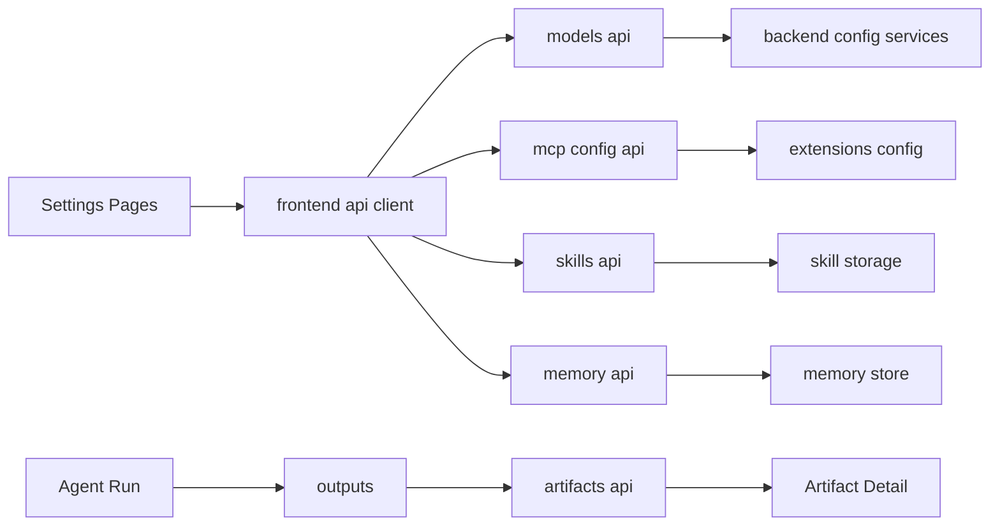
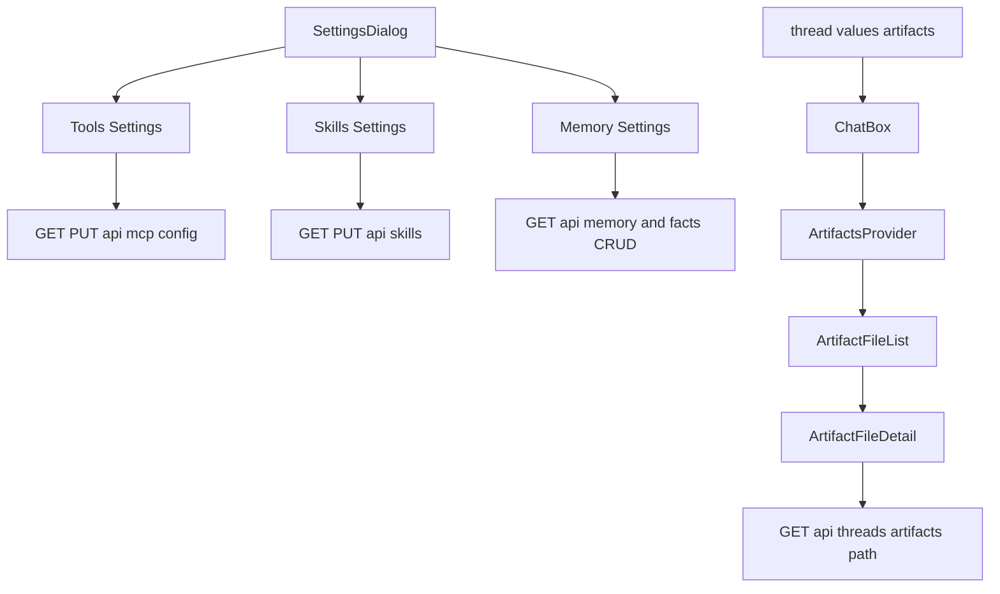
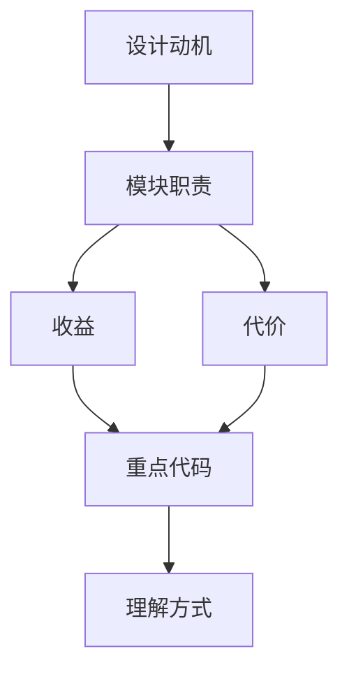

<title>07｜Frontend Settings、Models、Artifacts 数据流详解</title>

<callout emoji="✅">
**本章目标：** 讲清前端 Settings 如何管理后端配置，以及 Artifacts 如何从 thread state 变成右侧可预览文件。
</callout>

---

# 可视化增强：设置与产物双通道图

<callout emoji="💡">
**图解目标：**补充 settings 写配置、artifacts 读产物的双通道图，区分管理面和运行面。
</callout>

## 1. 设置与产物双通道图

| 读图对象 | 图里怎么看 | 维护入口 |
|-|-|-|
| 模块职责 | Settings 是管理面，Artifacts 是运行结果展示面 | settings pages、artifacts components |
| 数据流 | 配置写到后端服务，产物从 run outputs 读回前端 | frontend/core/api、routers |
| 阅读路径 | 先分清 settings mutation 和 artifact retrieval | 07 章节 |

# 1. Settings 总入口

# 2. Models 与 thread context

# 3. Artifacts 面板

# 4. Settings 模块明细

| 模块 | 前端文件 | 后端 API/存储 |
|-|-|-|
| Models | `core/models/api.ts`、`input-box.tsx` | `GET /api/models` |
| MCP Tools | `settings/tool-settings-page.tsx`、`core/mcp/*` | `GET/PUT /api/mcp/config` |
| Skills | `settings/skill-settings-page.tsx`、`core/skills/*` | `GET /api/skills`、`PUT /api/skills/{name}` |
| Memory | `settings/memory-settings-page.tsx`、`core/memory/*` | `GET/DELETE /api/memory`、facts CRUD |
| Local Settings | `core/settings/*` | localStorage |

# 5. 调试建议

- Settings 页数据不更新：先看 React Query key 是否 invalidate。
- Artifact 预览失败：先检查 `thread.values.artifacts` 和 artifact URL 是否编码正确。
- 模型切换无效：检查 `thread.submit context.model_name` 是否传到后端。

## 补充：Settings 与 Artifacts 简化运行图

<callout emoji="💡">
本图用简化节点补充 Settings 与 Artifacts 的运行逻辑，便于新同学快速理解数据从 UI 到 Gateway API 的路径。
</callout>

---

# 补充：设计取舍、重点代码与阅读路径

<callout emoji="💡">
**设计目的：**Settings 和 Artifacts 独立成模块，是为了把配置管理和产物预览从聊天主流程里拆出去。
</callout>

| 维度 | 说明 |
|-|-|
| 收益 | 收益是 chat 页面不臃肿；代价是状态来源分散在 React Query、localStorage、thread.values。 |
| 代价 | 见收益说明中的代价部分；此章节采用收益与代价合并描述。 |
| 重点代码 | 重点代码：`/Users/bytedance/deer-flow/frontend/src/components/workspace/settings/settings-dialog.tsx`、`/Users/bytedance/deer-flow/frontend/src/components/workspace/artifacts/artifact-file-detail.tsx`。 |
| 阅读路径 | 阅读路径：Settings 改配置，Artifacts 读 thread.values.artifacts。 |

