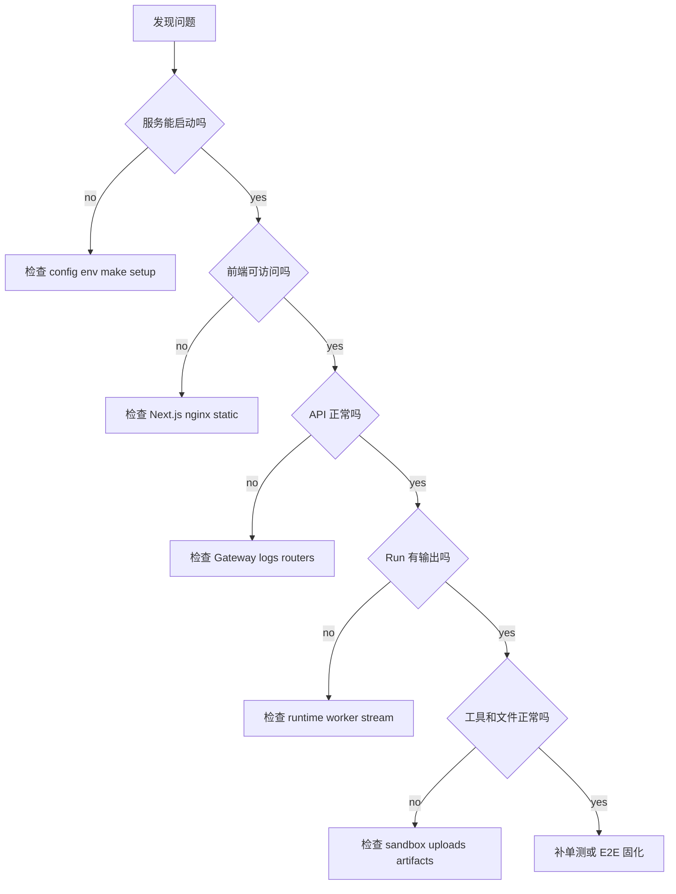
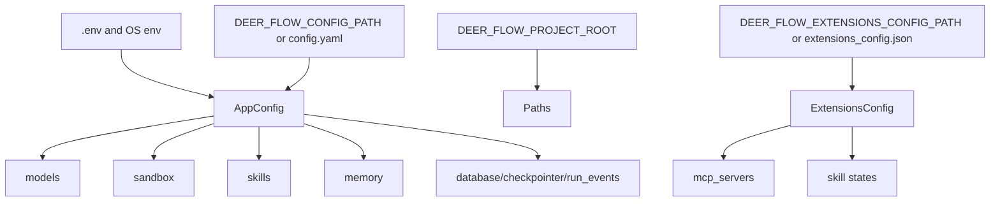
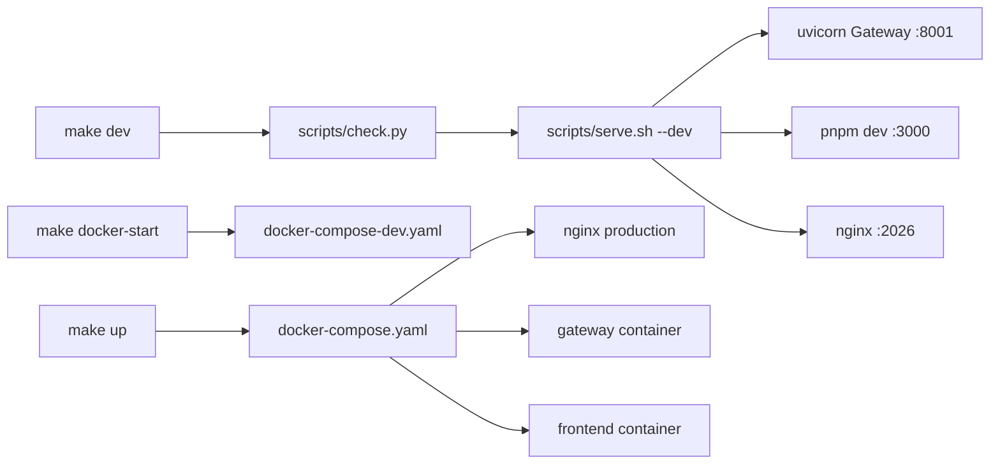
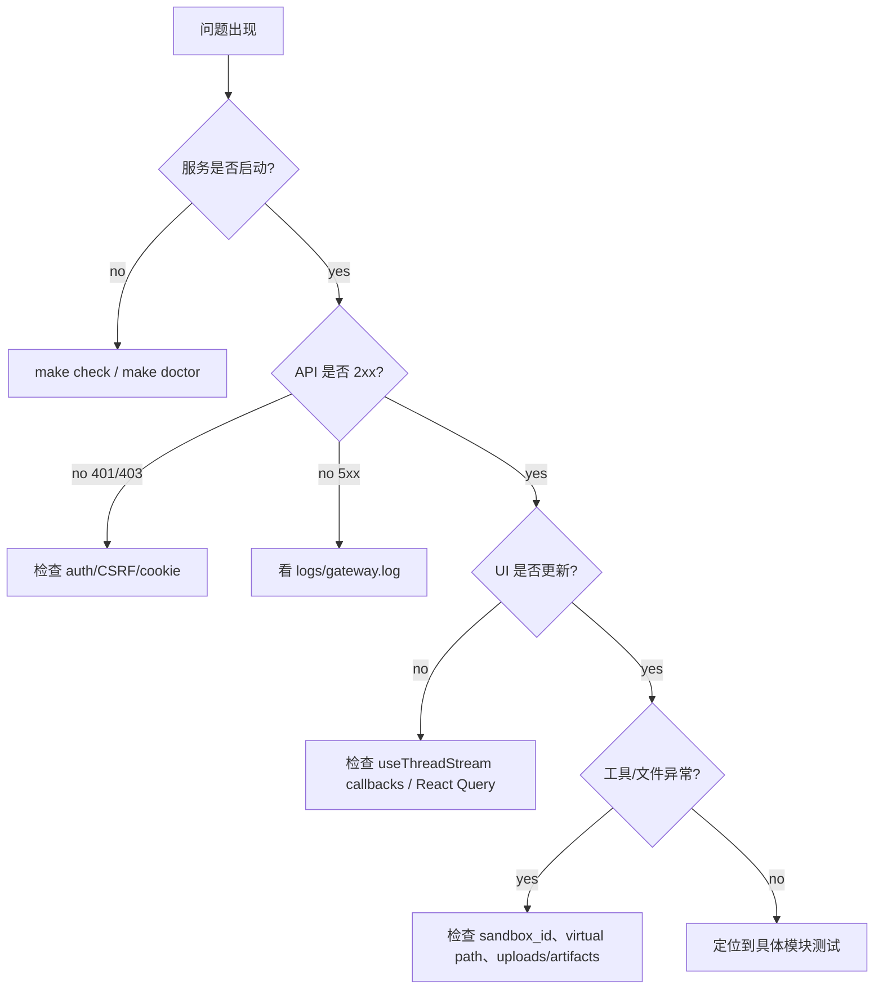
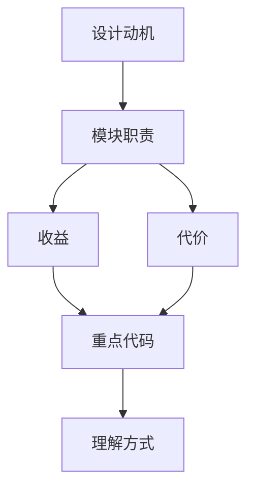

<title>08｜配置、部署、测试与排障详解</title>

<callout emoji="✅">
**本章目标：** 讲清本地开发需要看哪些配置和命令，以及出问题时如何从日志、API、测试定位。
</callout>

---

# 可视化增强：排障决策树

<callout emoji="💡">
**图解目标：**补充从现象到配置/部署/测试/日志的决策树，让读者先定位排障入口。
</callout>

## 1. 排障入口决策树



| 读图对象 | 图里怎么看 | 维护入口 |
|-|-|-|
| 模块职责 | 把配置、部署、运行、测试排障串成入口图 | README、Install、Makefile、docker |
| 数据流 | 从用户现象一路缩小到具体层级 | logs、doctor、tests |
| 阅读路径 | 按决策树先判层，再进入对应章节 | 08 章节 |

# 1. 配置加载



# 2. Makefile 命令地图

| 命令 | 用途 | 底层入口 |
|-|-|-|
| `make setup` | 交互式初始化 | `scripts/setup_wizard.py` |
| `make doctor` | 诊断配置和系统要求 | `scripts/doctor.py` |
| `make check` | 检查依赖 | `scripts/check.py` |
| `make install` | 安装 backend/frontend 依赖 | `uv sync`、`pnpm install` |
| `make dev` | 本地开发启动 | `scripts/serve.sh --dev` |
| `make docker-start` | Docker 开发启动 | `scripts/docker.sh start` |
| `make up` | 生产 Docker 启动 | `scripts/deploy.sh` |

# 3. 部署模式



# 4. 测试入口

```bash
cd /Users/bytedance/deer-flow
make check
make doctor
make detect-blocking-io

cd backend
make test
make lint

cd ../frontend
pnpm typecheck
pnpm test
pnpm build
pnpm test:e2e
```

# 5. 排障决策树



# 6. 日志与快速 API

```bash
curl http://localhost:2026/api/models
curl http://localhost:2026/api/skills
curl http://localhost:2026/api/memory/status
curl http://localhost:2026/api/mcp/config

ls -la /Users/bytedance/deer-flow/logs
tail -f /Users/bytedance/deer-flow/logs/gateway.log
```

---

# 补充：设计取舍、重点代码与阅读路径

<callout emoji="💡">
**设计目的：**把配置、部署、测试统一成 Makefile/scripts，是为了给开发者稳定入口。
</callout>

| 维度 | 说明 |
|-|-|
| 收益 | 收益是命令统一；代价是脚本层会隐藏底层服务细节。 |
| 代价 | 见收益说明中的代价部分；此章节采用收益与代价合并描述。 |
| 重点代码 | 重点代码：`/Users/bytedance/deer-flow/Makefile`、`/Users/bytedance/deer-flow/scripts/serve.sh`、`/Users/bytedance/deer-flow/scripts/check.py`。 |
| 阅读路径 | 阅读路径：先看 make 目标，再跳到脚本实现。 |

