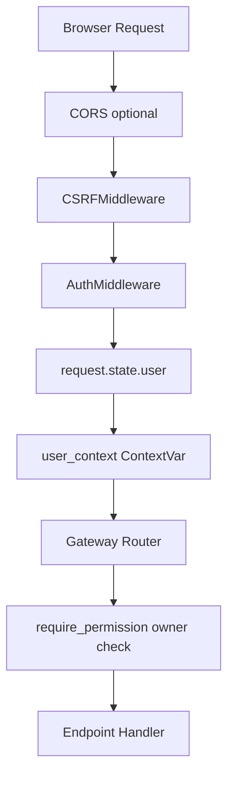
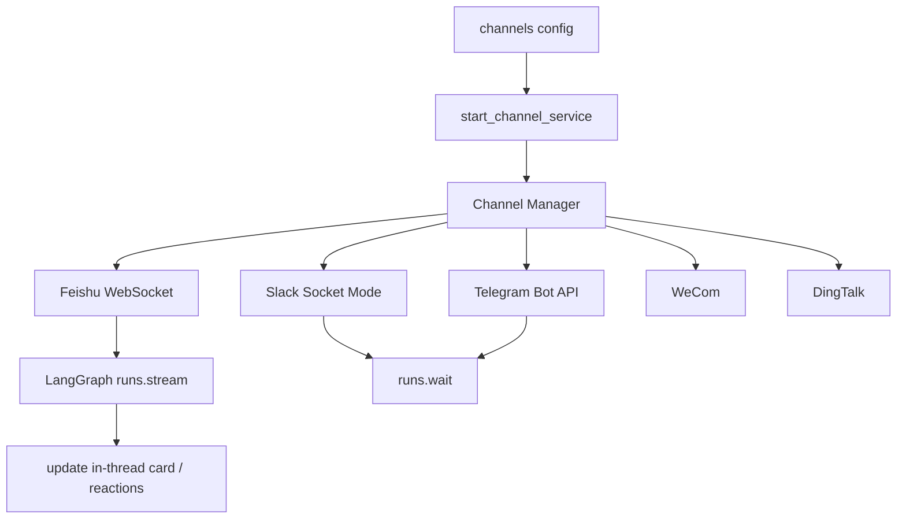
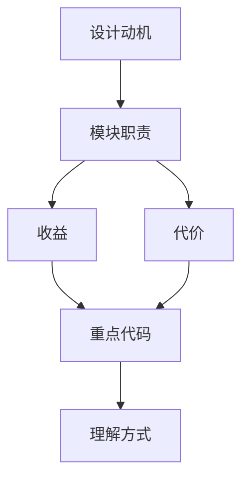

<title>09｜Auth、CSRF、权限与 IM Channels 详解</title>

<callout emoji="✅">
**本章目标：** 讲清 Gateway 请求如何经过认证、安全和渠道系统，避免把业务 router 当成唯一入口。
</callout>

# 1. HTTP 安全链路



# 2. Auth 模块职责

| 文件 | 职责 |
|-|-|
| `backend/app/gateway/auth_middleware.py` | 全局认证入口，识别 public path、session、internal auth、auth_disabled。 |
| `backend/app/gateway/csrf_middleware.py` | 状态变更请求校验 CSRF token，登录后下发 cookie。 |
| `backend/app/gateway/authz.py` | router 级权限检查和 owner check。 |
| `backend/app/gateway/routers/auth.py` | 登录、注册、初始化 admin、修改密码等 auth API。 |
| `backend/app/gateway/auth/local_provider.py` | 本地用户 provider。 |

# 3. IM Channels 运行逻辑



# 4. 修改与排障

- 401/403：先看 AuthMiddleware 是否打上 request.state.user，再看 router 是否有 require_permission。
- POST 失败但 GET 正常：优先检查 CSRF cookie 和 X-CSRF-Token。
- IM 渠道不工作：先看 config.yaml channels，再看 `backend/app/channels/service.py` 启动日志。

```text
backend/app/gateway/auth_middleware.py
backend/app/gateway/csrf_middleware.py
backend/app/gateway/authz.py
backend/app/channels/service.py
backend/app/channels/feishu.py
```

---

# 补充：设计取舍、重点代码与阅读路径

<callout emoji="💡">
**设计目的：**Auth 和 channel 是 Gateway 的边界能力：一个保护访问，一个接入外部 IM。
</callout>

| 维度 | 说明 |
|-|-|
| 收益 | 收益是 Web 和 IM 共用 runtime；代价是身份、CSRF、channel 用户映射需要小心。 |
| 代价 | 见收益说明中的代价部分；此章节采用收益与代价合并描述。 |
| 重点代码 | 重点代码：`/Users/bytedance/deer-flow/backend/app/gateway/auth_middleware.py`、`/Users/bytedance/deer-flow/backend/app/gateway/csrf_middleware.py`、`/Users/bytedance/deer-flow/backend/app/channels/manager.py`。 |
| 阅读路径 | 阅读路径：Web 请求走 auth middleware，IM 消息走 channel manager。 |

