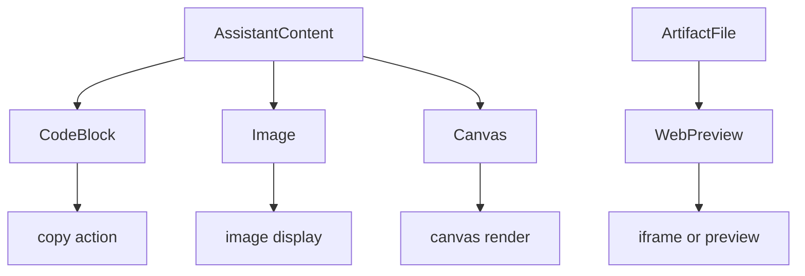
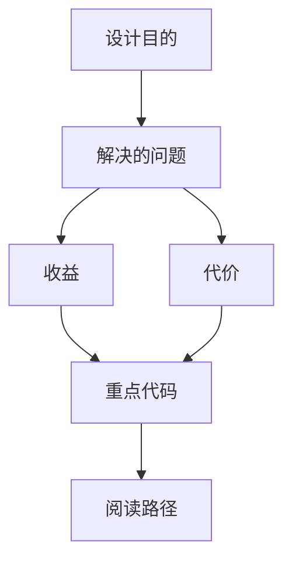

<title>104｜AI Elements CodeBlock、WebPreview、Canvas、Image 详解</title>

<callout emoji="✅">
**本章目标：**单独讲解该模块职责、输入输出和运行逻辑。
</callout>

| 模块点 | 说明 |
|-|-|
| code-block.tsx | 代码块展示、高亮和复制。 |
| web-preview.tsx | 网页/HTML 预览容器。 |
| canvas.tsx | Canvas 类 AI 产物展示。 |
| image.tsx | 图片元素展示。 |
| artifact.tsx | 与 artifact panel 形成更高层封装。 |

---

# 补充：设计取舍、重点代码与阅读路径

<callout emoji="💡">
**设计目的：**该模块单独成章，是为了把职责边界、运行逻辑和维护入口从大系统中抽出来。
</callout>

| 维度 | 说明 |
|-|-|
| 收益 | 收益是学习和定位更聚焦。 |
| 代价 | 代价是章节数量更多，需要依赖目录维护。 |
| 重点代码 | 重点代码见本章列出的文件路径。 |
| 阅读路径 | 阅读路径：先看上游输入和下游输出，再读关键函数。 |

