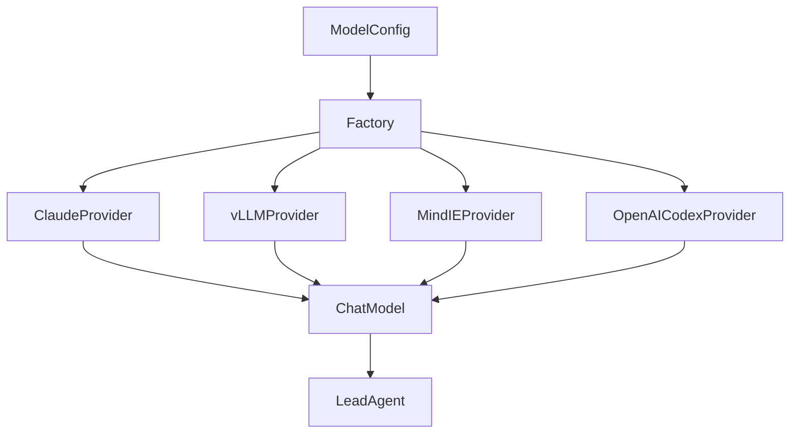
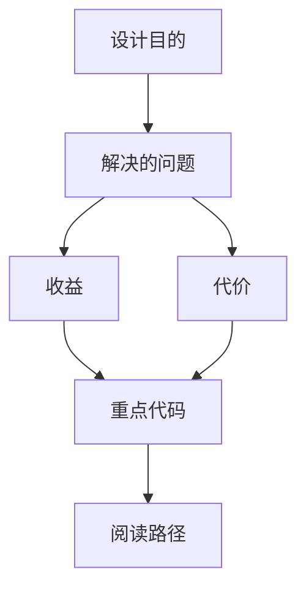

<title>108｜Claude、vLLM、MindIE、OpenAI Codex Provider 详解</title>

<callout emoji="✅">
**本章目标：**单独讲解该模块职责、输入输出和运行逻辑。
</callout>

| 模块点 | 说明 |
|-|-|
| claude_provider.py | Claude provider 封装。 |
| vllm_provider.py | vLLM OpenAI-compatible 或本地推理适配。 |
| mindie_provider.py | MindIE provider 适配。 |
| openai_codex_provider.py | Codex/OpenAI 特定 provider。 |
| factory.py | 按 use 字段解析这些 provider。 |

---

# 补充：设计取舍、重点代码与阅读路径

<callout emoji="💡">
**设计目的：**该模块单独成章，是为了把职责边界、运行逻辑和维护入口从大系统中抽出来。
</callout>

| 维度 | 说明 |
|-|-|
| 收益 | 收益是学习和定位更聚焦。 |
| 代价 | 代价是章节数量更多，需要依赖目录维护。 |
| 重点代码 | 重点代码见本章列出的文件路径。 |
| 阅读路径 | 阅读路径：先看上游输入和下游输出，再读关键函数。 |

