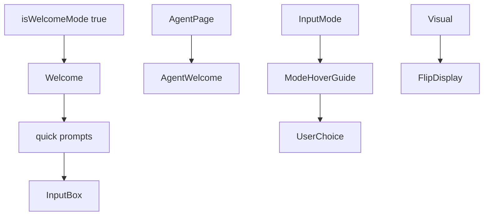
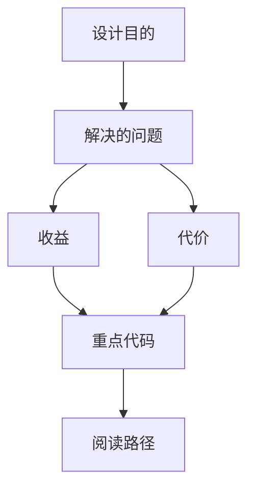

<title>118｜Workspace Welcome 与 AgentWelcome 组件详解</title>

<callout emoji="✅">
**本章目标：**继续按 workspace 业务组件讲解职责、输入输出和运行逻辑。
</callout>

| 组件/文件 | 说明 |
|-|-|
| welcome.tsx | 新会话欢迎态、快捷提示。 |
| agent-welcome.tsx | Agent 页面欢迎/引导。 |
| mode-hover-guide.tsx | 模式 hover 说明。 |
| flip-display.tsx | 动态展示效果。 |

---

# 补充：设计取舍、重点代码与阅读路径

<callout emoji="💡">
**设计目的：**该模块单独成章，是为了把职责边界、运行逻辑和维护入口从大系统中抽出来。
</callout>

| 维度 | 说明 |
|-|-|
| 收益 | 收益是学习和定位更聚焦。 |
| 代价 | 代价是章节数量更多，需要依赖目录维护。 |
| 重点代码 | 重点代码见本章列出的文件路径。 |
| 阅读路径 | 阅读路径：先看上游输入和下游输出，再读关键函数。 |

