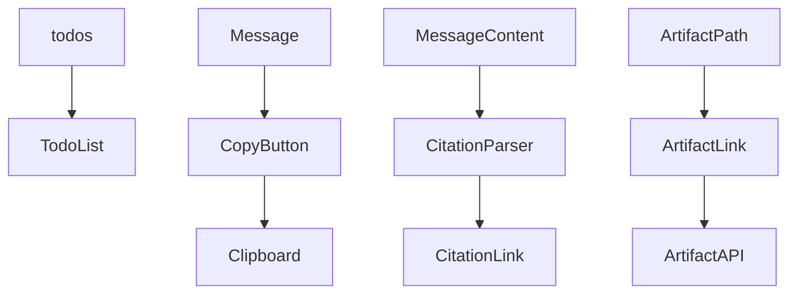
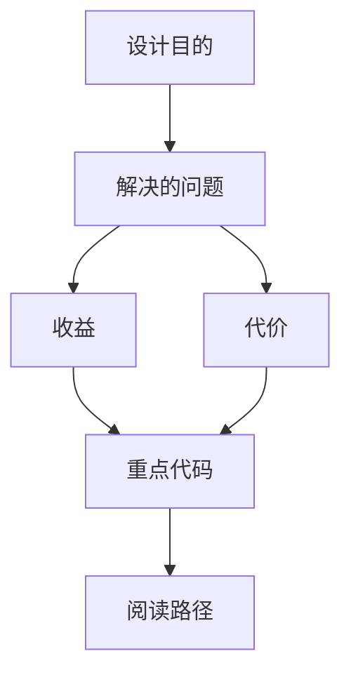

<title>120｜TodoList、CopyButton、Citations 组件详解</title>

<callout emoji="✅">
**本章目标：**继续按 workspace 业务组件讲解职责、输入输出和运行逻辑。
</callout>

| 组件/文件 | 说明 |
|-|-|
| todo-list.tsx | 展示 thread.values.todos。 |
| copy-button.tsx | 复制消息/代码内容。 |
| citations/citation-link.tsx | 渲染引用链接。 |
| citations/artifact-link.tsx | 把 artifact path 转成可点击链接。 |

---

# 补充：设计取舍、重点代码与阅读路径

<callout emoji="💡">
**设计目的：**该模块单独成章，是为了把职责边界、运行逻辑和维护入口从大系统中抽出来。
</callout>

| 维度 | 说明 |
|-|-|
| 收益 | 收益是学习和定位更聚焦。 |
| 代价 | 代价是章节数量更多，需要依赖目录维护。 |
| 重点代码 | 重点代码见本章列出的文件路径。 |
| 阅读路径 | 阅读路径：先看上游输入和下游输出，再读关键函数。 |

