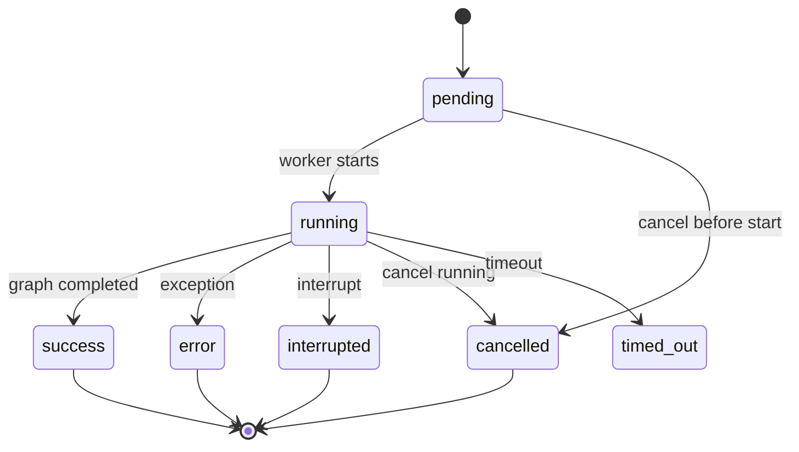
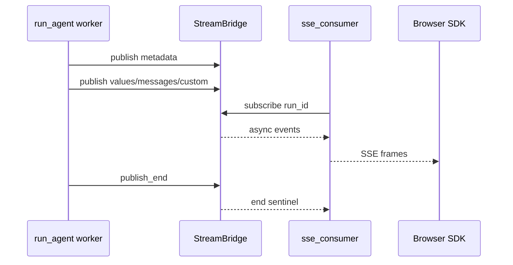
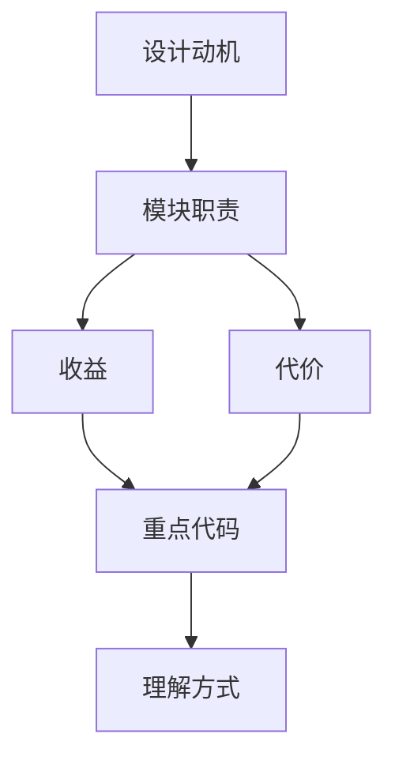

<title>12｜Runtime RunManager、StreamBridge、Journal 详解</title>

<callout emoji="✅">
**本章目标：**深入 run 执行期：run record 如何变更状态，agent chunks 如何变成 SSE，事件如何被 journal 记录。
</callout>

# 1. Runtime 子模块

| 模块 | 职责 | 关键文件 |
|-|-|-|
| RunManager | 创建、查询、取消、恢复 run record | `runtime/runs/manager.py` |
| run_agent worker | 执行 agent graph、发布 stream、收尾状态 | `runtime/runs/worker.py` |
| StreamBridge | run task 和 HTTP SSE consumer 之间的异步事件桥 | `runtime/stream_bridge/*` |
| RunJournal | 记录 messages、events、token usage、trace 关联 | `runtime/journal.py` |
| Serialization | 把 LangChain message/state 转为 JSON 安全结构 | `runtime/serialization.py` |

# 2. Run 状态机

# 3. StreamBridge 工作逻辑

# 4. 失败恢复与收尾

- Gateway 启动时会 reconcile orphan inflight runs，避免重启后 run 永远处于 running。
- worker 收尾会 flush journal、同步 title/status、发布 end sentinel。
- 取消支持 interrupt 和 rollback；rollback 依赖 pre-run checkpoint。

---

# 补充：设计取舍、重点代码与阅读路径

<callout emoji="💡">
**设计目的：**RunManager 管状态，StreamBridge 管流，Journal 管事件，是 run lifecycle 的三件套。
</callout>

| 维度 | 说明 |
|-|-|
| 收益 | 收益是职责独立；代价是调试要同时看 run 状态、SSE、事件存储。 |
| 代价 | 见收益说明中的代价部分；此章节采用收益与代价合并描述。 |
| 重点代码 | 重点代码：`/Users/bytedance/deer-flow/backend/packages/harness/deerflow/runtime/runs/manager.py`、`/Users/bytedance/deer-flow/backend/packages/harness/deerflow/runtime/stream_bridge`、`/Users/bytedance/deer-flow/backend/packages/harness/deerflow/runtime/journal.py`。 |
| 阅读路径 | 阅读路径：状态、流、历史分开看。 |

