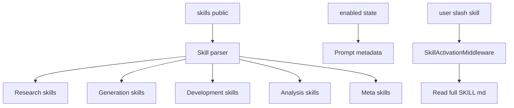
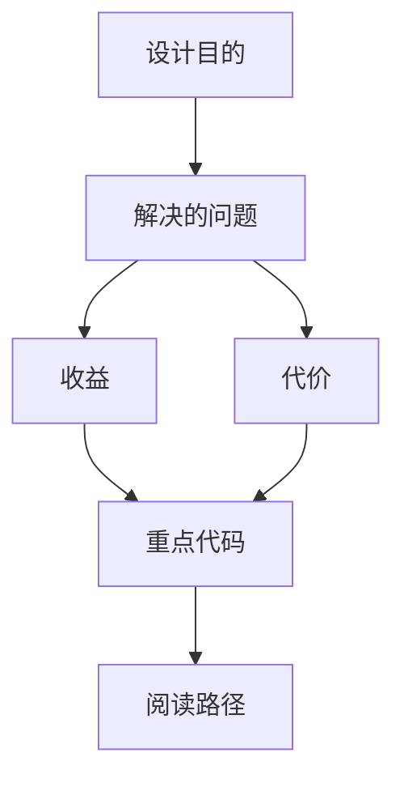

<title>138｜Public Skills 分类与运行逻辑详解</title>

<callout emoji="✅">
**本章目标：**补齐测试、脚本、Docker、Skills 分类，解释运行逻辑。
</callout>

| 模块点 | 说明 |
|-|-|
| Research | deep-research、github-deep-research、academic-paper-review、systematic-literature-review。 |
| Generation | image/music/video/podcast/ppt/newsletter。 |
| Development | frontend-design、code-documentation、vercel-deploy、claude-to-deerflow。 |
| Analysis | data-analysis、consulting-analysis、chart-visualization。 |
| Meta | skill-creator、find-skills、bootstrap、surprise-me。 |

## 补充：Public Skills 分类简化运行图

---

# 补充：设计取舍、重点代码与阅读路径

<callout emoji="💡">
**设计目的：**该模块承担 agent 扩展能力，是为了把工具、知识、长期上下文或执行环境做成可组合部件。
</callout>

| 维度 | 说明 |
|-|-|
| 收益 | 收益是可扩展、可配置、可替换。 |
| 代价 | 代价是配置、prompt、工具 schema、外部服务任一环节出错都会影响结果。 |
| 重点代码 | 重点代码在 `backend/packages/harness/deerflow` 下对应 skills/mcp/memory/sandbox/tools/models 模块。 |
| 阅读路径 | 阅读路径：明确它给 agent 增加了什么能力，以及该能力在哪里被注入。 |

