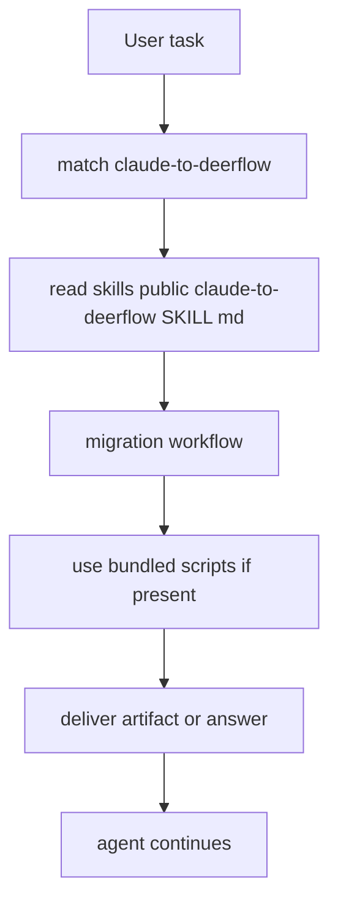
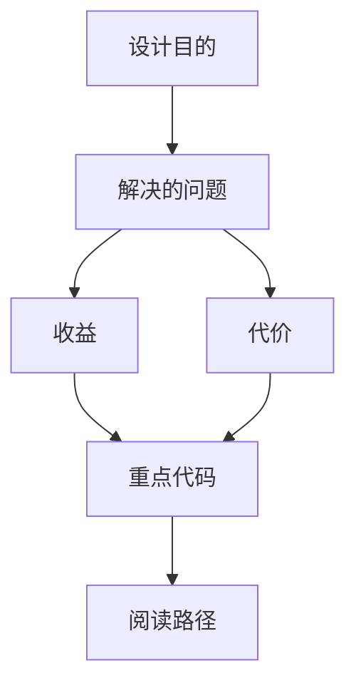

<title>166｜claude-to-deerflow Public Skill 详解</title>

<callout emoji="✅">
**Skill 目标：**Claude 到 DeerFlow 的迁移/状态工具。
</callout>

| 字段 | 说明 |
|-|-|
| Skill 名称 | `claude-to-deerflow` |
| 路径 | `skills/public/claude-to-deerflow/SKILL.md` |
| 类型 | migration |
| 触发方式 | 任务匹配或显式 `/claude-to-deerflow` |

---

# 补充：设计取舍、重点代码与阅读路径

<callout emoji="💡">
**设计目的：**这个模块以 API/边界层拆分，是为了隔离 HTTP 协议、认证鉴权、请求模型和内部业务。
</callout>

| 维度 | 说明 |
|-|-|
| 收益 | 收益是前后端契约清晰，接口可独立演进。 |
| 代价 | 代价是一次功能可能跨 router、service、repository 和前端 hook。 |
| 重点代码 | 重点代码在 `backend/app/gateway/routers/`、`backend/app/gateway/auth*` 或对应前端 `core/*/api.ts`。 |
| 阅读路径 | 阅读路径：从 URL/API 入口往内追 service，再看数据落到哪里。 |

