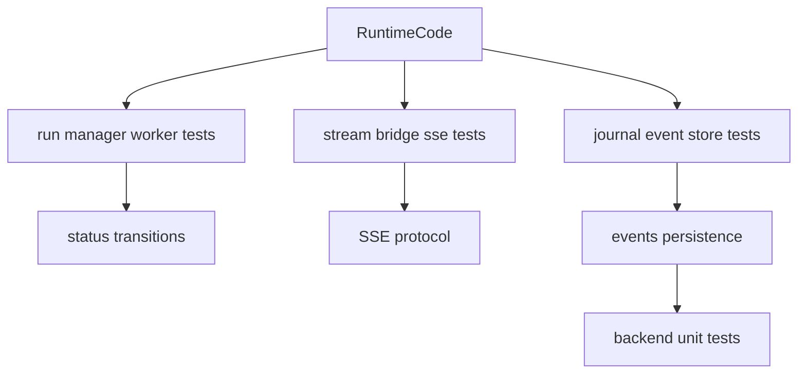
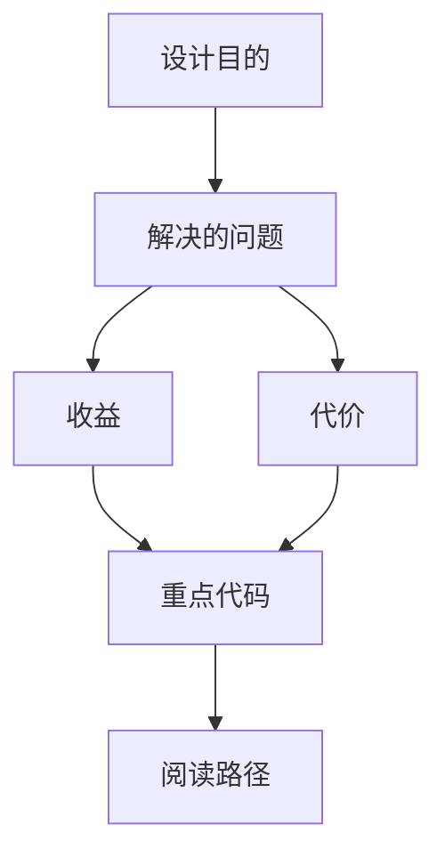

<title>168｜Backend Runtime/Run/Stream Tests 分类详解</title>

<callout emoji="✅">
**本章目标：**继续拆测试/CI/脚本模块，说明覆盖范围、运行入口和逻辑。
</callout>

| 模块点 | 说明 |
|-|-|
| run_manager/run_repository | run 状态、持久化、恢复。 |
| run_worker_rollback | rollback checkpoint。 |
| stream_bridge/sse_format | SSE 格式和 bridge。 |
| run_journal/run_event_store | 事件记录和分页。 |
| thread_token_usage | token usage 聚合。 |

---

# 补充：设计取舍、重点代码与阅读路径

<callout emoji="💡">
**设计目的：**这个模块采用 middleware 形态，是为了把横切逻辑从核心 agent 流程里剥离，按 before/after/wrap 阶段插入。
</callout>

| 维度 | 说明 |
|-|-|
| 收益 | 收益是职责独立、便于单测和按配置启停。 |
| 代价 | 代价是顺序和状态合并不直观，多 middleware 同时改 messages/state 时需要按链路排查。 |
| 重点代码 | 重点代码在 `backend/packages/harness/deerflow/agents/middlewares/` 对应文件，优先看 hook 方法。 |
| 阅读路径 | 阅读路径：先定位 hook 阶段，再看它读写哪个 state 字段。 |

