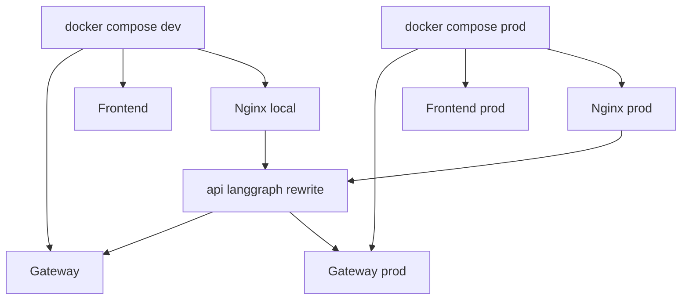
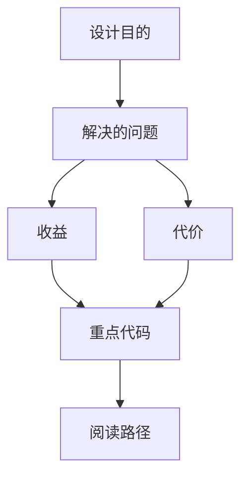

<title>189｜docker-compose 与 nginx 配置单文件详解</title>

<callout emoji="✅">
**本章目标：**继续拆 Docker、Provisioner、脚本和测试细模块。
</callout>

| 模块点 | 说明 |
|-|-|
| docker-compose-dev.yaml | 开发 compose，源码挂载和热更新。 |
| docker-compose.yaml | 生产 compose。 |
| nginx.local.conf | 本地 nginx 反代。 |
| nginx.conf | 生产 nginx 反代。 |
| dev-entrypoint.sh | 开发容器入口。 |

## 补充：Docker Compose 简化运行图

---

# 补充：设计取舍、重点代码与阅读路径

<callout emoji="💡">
**设计目的：**该模块单独成章，是为了把职责边界、运行逻辑和维护入口从大系统中抽出来。
</callout>

| 维度 | 说明 |
|-|-|
| 收益 | 收益是学习和定位更聚焦。 |
| 代价 | 代价是章节数量更多，需要依赖目录维护。 |
| 重点代码 | 重点代码见本章列出的文件路径。 |
| 阅读路径 | 阅读路径：先看上游输入和下游输出，再读关键函数。 |

