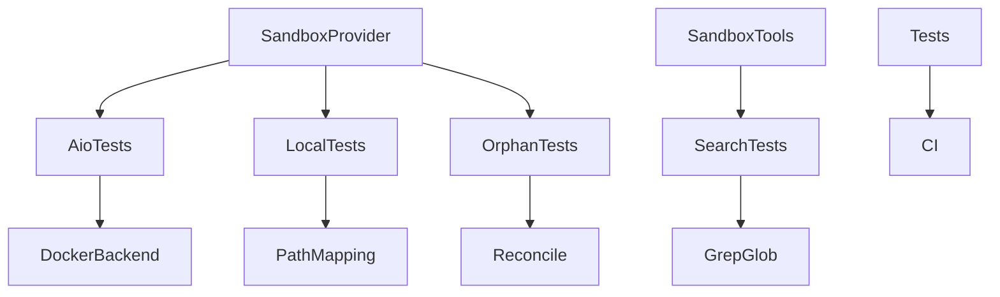
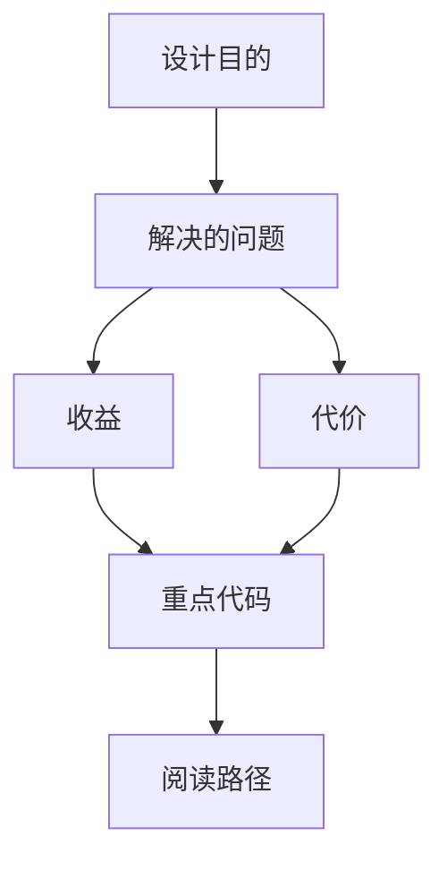

<title>195｜Sandbox Provider 深层测试族详解</title>

<callout emoji="✅">
**本章目标：**继续补齐剩余测试与文档规格模块。
</callout>

| 模块点 | 说明 |
|-|-|
| test_aio_sandbox\*.py | AioSandbox provider/backend/readiness。 |
| test_local_sandbox\_\* | 本地 sandbox 编码、路径、mount、bash。 |
| test_sandbox_orphan_reconciliation\* | sandbox 孤儿容器恢复。 |
| test_sandbox_search_tools.py | grep/glob 搜索工具。 |

---

# 补充：设计取舍、重点代码与阅读路径

<callout emoji="💡">
**设计目的：**该模块承担 agent 扩展能力，是为了把工具、知识、长期上下文或执行环境做成可组合部件。
</callout>

| 维度 | 说明 |
|-|-|
| 收益 | 收益是可扩展、可配置、可替换。 |
| 代价 | 代价是配置、prompt、工具 schema、外部服务任一环节出错都会影响结果。 |
| 重点代码 | 重点代码在 `backend/packages/harness/deerflow` 下对应 skills/mcp/memory/sandbox/tools/models 模块。 |
| 阅读路径 | 阅读路径：明确它给 agent 增加了什么能力，以及该能力在哪里被注入。 |

