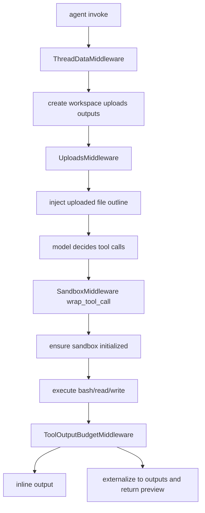
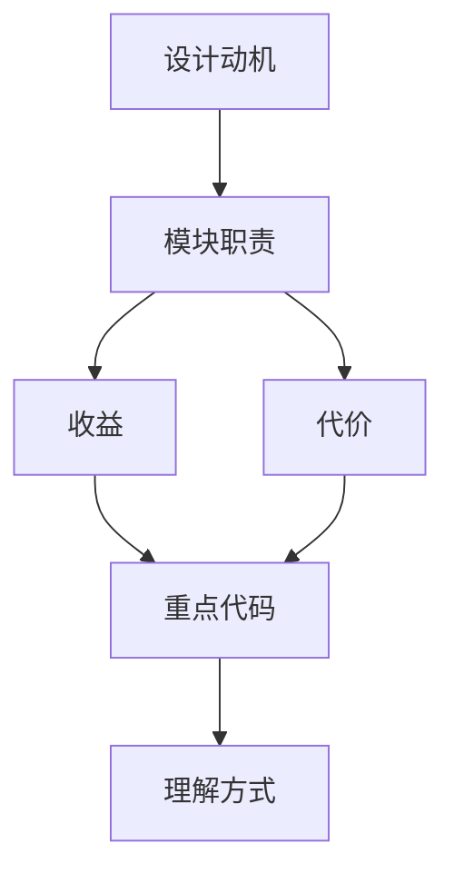

<title>19｜Middleware 基建类文件详解：ThreadData、Uploads、Sandbox、ToolOutputBudget</title>

<callout emoji="✅">
**本章目标：**把直接影响文件系统、上传文件、sandbox 和工具输出预算的四类 middleware 拆开讲。
</callout>

# 1. 模块职责

| 文件 | 核心职责 | 读写状态 |
|-|-|-|
| `thread_data_middleware.py` | 根据 user/thread 创建 workspace/uploads/outputs 物理目录 | `thread_data` |
| `uploads_middleware.py` | 读取 uploads 目录、提取文件 outline、注入 uploaded_files 上下文 | `uploaded_files/messages` |
| `sandbox/middleware.py` | 懒加载 sandbox、释放 sandbox、把 sandbox_id 写入 state | `sandbox` |
| `tool_output_budget_middleware.py` | 工具输出过大时外置到 outputs，避免污染上下文 | `messages/artifacts` |

# 2. 基建 middleware 运行图

# 3. 常见问题定位

- Agent 看不到上传文件：查 uploads 目录、UploadsMiddleware 是否注入。
- 工具找不到路径：查 ThreadDataMiddleware 创建的虚拟路径映射。
- 输出被截断：查 ToolOutputBudgetMiddleware 的阈值和 outputs 产物。

---

# 补充：设计取舍、重点代码与阅读路径

<callout emoji="💡">
**设计目的：**ThreadData、Uploads、Sandbox、ToolOutputBudget 是 agent 能处理文件的基础设施。
</callout>

| 维度 | 说明 |
|-|-|
| 收益 | 收益是工具上下文安全可控；代价是路径和输出预算增加理解成本。 |
| 代价 | 见收益说明中的代价部分；此章节采用收益与代价合并描述。 |
| 重点代码 | 重点代码：`/Users/bytedance/deer-flow/backend/packages/harness/deerflow/agents/middlewares/thread_data_middleware.py`、`/Users/bytedance/deer-flow/backend/packages/harness/deerflow/agents/middlewares/uploads_middleware.py`、`/Users/bytedance/deer-flow/backend/packages/harness/deerflow/sandbox/middleware.py`。 |
| 阅读路径 | 阅读路径：先有目录，再有上传上下文，再有 sandbox 工具。 |

