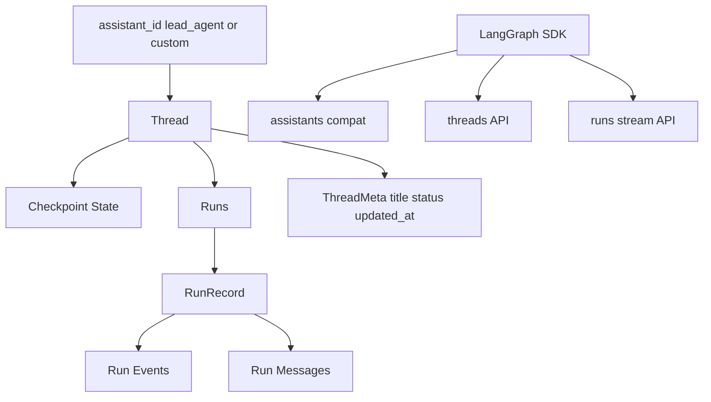
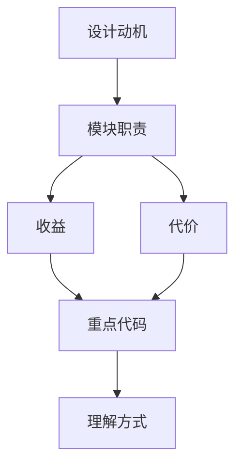

<title>21｜Run 与 Thread Router 文件级详解</title>

<callout emoji="✅">
**本章目标：**聚焦 thread_runs.py、runs.py、threads.py、assistants_compat.py，讲清 LangGraph-compatible API 表面。
</callout>

# 1. API 分组

| 文件 | 接口组 | 职责 |
|-|-|-|
| `thread_runs.py` | `/api/threads/{thread_id}/runs*` | 有 thread 的 run create/stream/wait/cancel/join/messages/events/token usage。 |
| `runs.py` | `/api/runs/*` | stateless stream/wait，自动创建或复用 thread。 |
| `threads.py` | `/api/threads*` | thread create/search/patch/get/state/history/delete。 |
| `assistants_compat.py` | `/api/assistants*` | 满足 LangGraph SDK 初始化需要，assistant_id 映射到 lead_agent。 |

# 2. Thread 与 Run 关系图



# 3. 典型请求

```text
POST /api/threads
POST /api/threads/search
GET  /api/threads/{thread_id}/state
POST /api/threads/{thread_id}/runs/stream
GET  /api/threads/{thread_id}/runs/{run_id}/join
POST /api/runs/stream
```

# 4. 风险点

- metadata 中 user_id/owner_id 属于服务端保留字段，threads.py 会剥离。
- run stream 需要处理 inactive worker 409，前端 api-client 有兼容逻辑。
- assistant_id 自定义 agent 实际仍通过 lead_agent graph 加 agent_name。

---

# 补充：设计取舍、重点代码与阅读路径

<callout emoji="💡">
**设计目的：**这个模块采用 router/API 分层，是为了把 HTTP 边界、鉴权、请求响应模型和内部服务逻辑分开。
</callout>

| 维度 | 说明 |
|-|-|
| 收益 | 收益是接口职责清晰，前端和外部 SDK 可稳定调用。 |
| 代价 | 代价是一次业务流常跨 router、service、runtime、repository 多层。 |
| 重点代码 | 重点代码在 `backend/app/gateway/routers/` 与 `backend/app/gateway/services.py`。 |
| 阅读路径 | 阅读路径：从 URL 路径找 router，再看 request model、authz、依赖注入和 service 调用。 |

