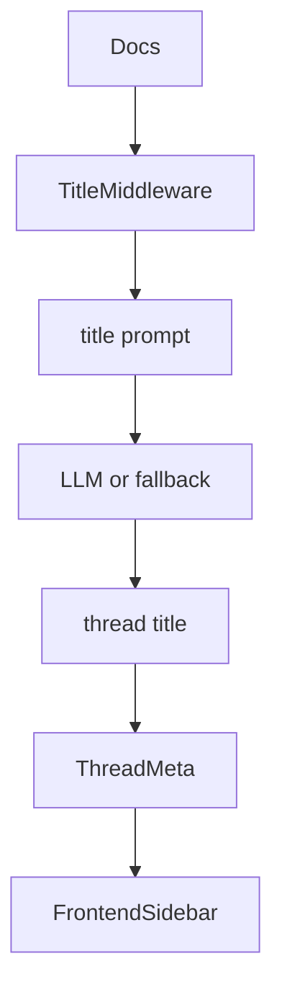
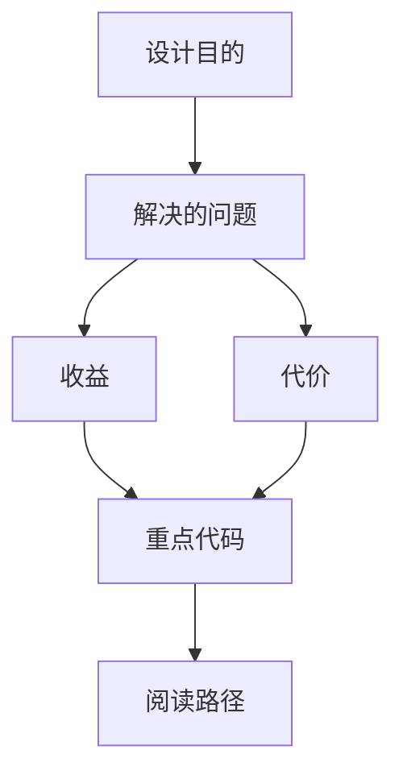

<title>223｜AUTO_TITLE / TITLE_GENERATION 文档单独详解</title>

<callout emoji="✅">
**本章目标：**继续拆剩余文档/content 模块，说明用途和关联运行逻辑。
</callout>

| 模块点 | 说明 |
|-|-|
| AUTO_TITLE_GENERATION.md | 自动标题功能说明。 |
| TITLE_GENERATION_IMPLEMENTATION.md | 实现细节。 |
| TitleMiddleware | 核心实现。 |
| Thread meta sync | run 收尾同步到会话列表。 |

---

# 补充：设计取舍、重点代码与阅读路径

<callout emoji="💡">
**设计目的：**该模块单独成章，是为了把职责边界、运行逻辑和维护入口从大系统中抽出来。
</callout>

| 维度 | 说明 |
|-|-|
| 收益 | 收益是学习和定位更聚焦。 |
| 代价 | 代价是章节数量更多，需要依赖目录维护。 |
| 重点代码 | 重点代码见本章列出的文件路径。 |
| 阅读路径 | 阅读路径：先看上游输入和下游输出，再读关键函数。 |

