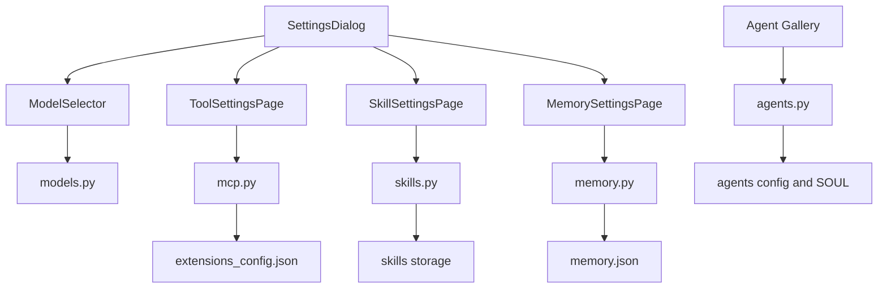
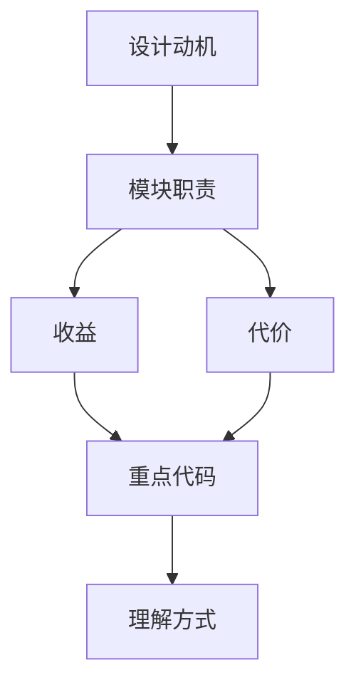

<title>22｜管理类 Router 文件级详解：Models、MCP、Skills、Memory、Agents</title>

<callout emoji="✅">
**本章目标：**聚焦 Settings 和管理页面背后的后端 router。
</callout>

# 1. 管理 API 总览

| Router | 接口 | 前端调用方 | 注意事项 |
|-|-|-|-|
| `models.py` | `GET /api/models` | InputBox ModelSelector | 不能返回 api_key。 |
| `mcp.py` | `GET/PUT /api/mcp/config` | Tools Settings | stdio command allowlist，secret mask。 |
| `skills.py` | `GET/PUT /api/skills`、custom CRUD | Skills Settings、Artifact .skill install | 写入 custom skill 前做安全扫描。 |
| `memory.py` | memory/facts/import/export | Memory Settings | per-user/per-agent memory。 |
| `agents.py` | custom agents CRUD | Agents gallery/new agent | 校验 agent name，读写 SOUL/config。 |

# 2. Settings 到 Router 数据流

# 3. 修改建议

- 新增 Settings 配置项：需要前端 core API、hook、页面，以及后端 router/schema。
- MCP 配置改动后要 reset tools cache/session pool。
- Skills custom 写入要保留 history，支持 rollback。

---

# 补充：设计取舍、重点代码与阅读路径

<callout emoji="💡">
**设计目的：**这个模块采用 router/API 分层，是为了把 HTTP 边界、鉴权、请求响应模型和内部服务逻辑分开。
</callout>

| 维度 | 说明 |
|-|-|
| 收益 | 收益是接口职责清晰，前端和外部 SDK 可稳定调用。 |
| 代价 | 代价是一次业务流常跨 router、service、runtime、repository 多层。 |
| 重点代码 | 重点代码在 `backend/app/gateway/routers/` 与 `backend/app/gateway/services.py`。 |
| 阅读路径 | 阅读路径：从 URL 路径找 router，再看 request model、authz、依赖注入和 service 调用。 |

