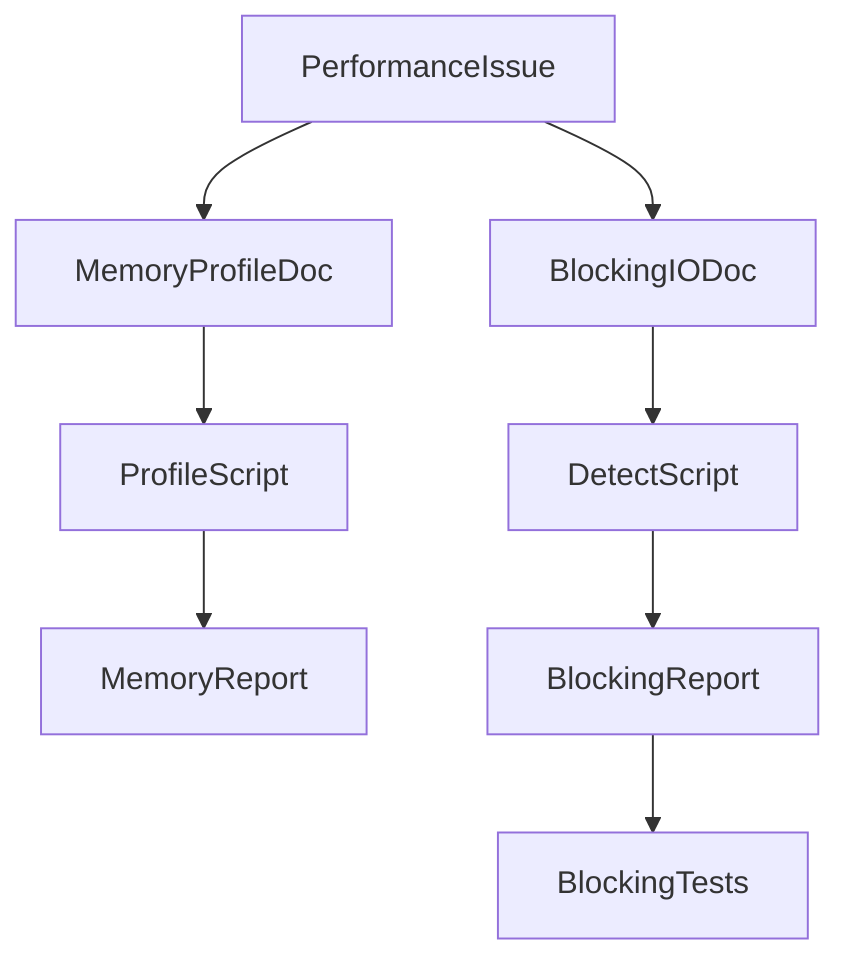
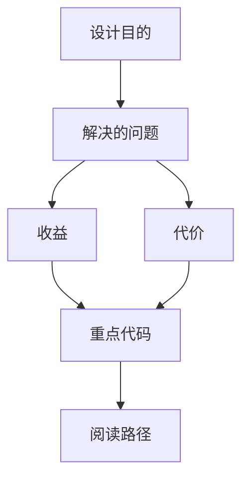

<title>240｜Sandbox Memory Profiling / Blocking IO Docs 详解</title>

<callout emoji="✅">
**本章目标：**继续细化 content/docs/evidence 模块并给出维护逻辑图。
</callout>

| 模块点 | 说明 |
|-|-|
| SANDBOX_MEMORY_PROFILING.md | sandbox 内存分析说明。 |
| BLOCKING_IO_DETECTION.md | 阻塞 IO 检测说明。 |
| sandbox_memory_profile.py | 内存画像脚本。 |
| detect_blocking_io_static.py | 阻塞 IO 静态检测。 |

---

# 补充：设计取舍、重点代码与阅读路径

<callout emoji="💡">
**设计目的：**该模块承担 agent 扩展能力，是为了把工具、知识、长期上下文或执行环境做成可组合部件。
</callout>

| 维度 | 说明 |
|-|-|
| 收益 | 收益是可扩展、可配置、可替换。 |
| 代价 | 代价是配置、prompt、工具 schema、外部服务任一环节出错都会影响结果。 |
| 重点代码 | 重点代码在 `backend/packages/harness/deerflow` 下对应 skills/mcp/memory/sandbox/tools/models 模块。 |
| 阅读路径 | 阅读路径：明确它给 agent 增加了什么能力，以及该能力在哪里被注入。 |

