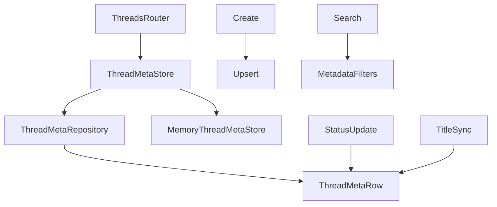
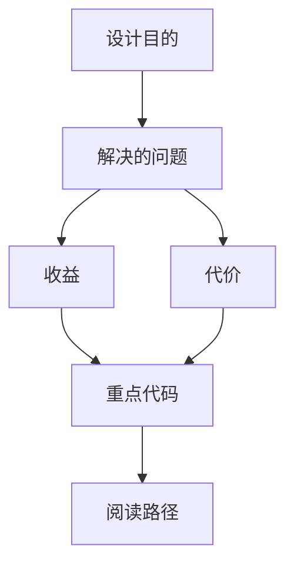

<title>260｜ThreadMetaRow / ThreadMetaRepository 详解</title>

<callout emoji="✅">
**本章目标：**继续拆 persistence/runtime 单文件，说明模型、仓储、provider 的调用关系。
</callout>

| 模块点 | 说明 |
|-|-|
| thread_meta/model.py | ThreadMetaRow。 |
| thread_meta/sql.py | SQL ThreadMetaRepository。 |
| thread_meta/memory.py | 内存实现。 |
| thread_meta/base.py | 抽象接口。 |
| make_thread_store | 根据 session factory 选择实现。 |

---

# 补充：设计取舍、重点代码与阅读路径

<callout emoji="💡">
**设计目的：**该模块单独成章，是为了把职责边界、运行逻辑和维护入口从大系统中抽出来。
</callout>

| 维度 | 说明 |
|-|-|
| 收益 | 收益是学习和定位更聚焦。 |
| 代价 | 代价是章节数量更多，需要依赖目录维护。 |
| 重点代码 | 重点代码见本章列出的文件路径。 |
| 阅读路径 | 阅读路径：先看上游输入和下游输出，再读关键函数。 |

