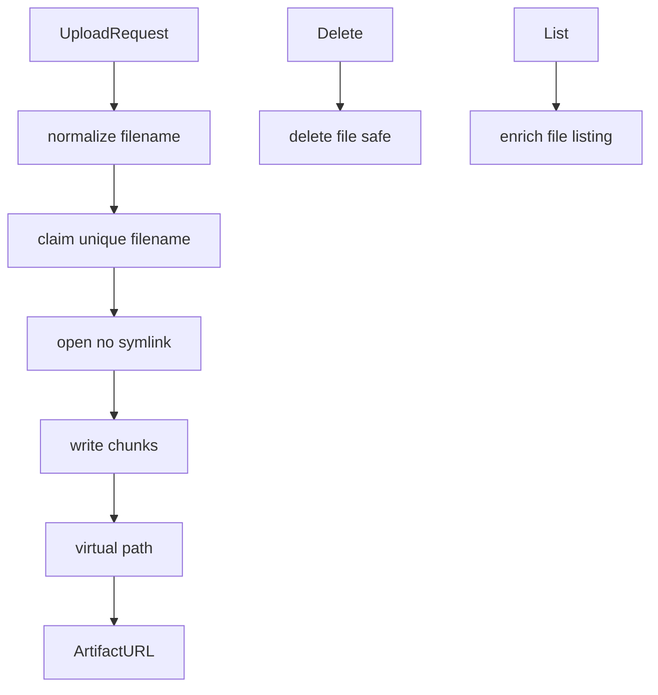
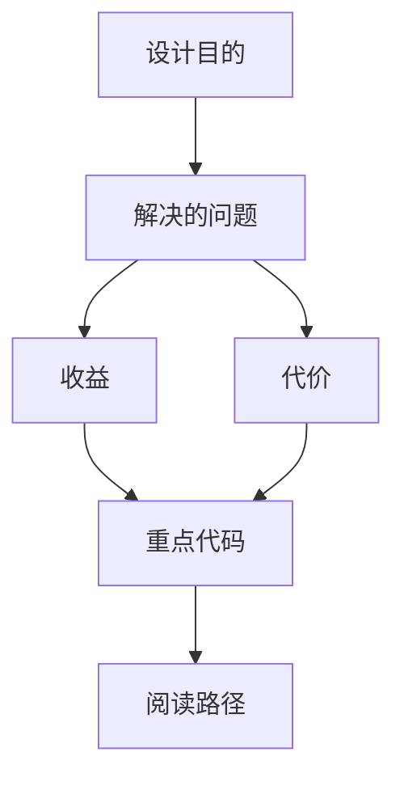

<title>277｜uploads/manager.py 单文件详解</title>

<callout emoji="✅">
**本章目标：**继续拆 tools/reflection/utils 等基础模块。
</callout>

| 模块点 | 说明 |
|-|-|
| normalize_filename | 文件名归一化。 |
| claim_unique_filename | 同批次重名处理。 |
| open_upload_file_no_symlink | 防 symlink 写入。 |
| delete_file_safe | 安全删除。 |
| upload_virtual_path/artifact_url | 生成虚拟路径和 artifact URL。 |

---

# 补充：设计取舍、重点代码与阅读路径

<callout emoji="💡">
**设计目的：**该模块单独成章，是为了把职责边界、运行逻辑和维护入口从大系统中抽出来。
</callout>

| 维度 | 说明 |
|-|-|
| 收益 | 收益是学习和定位更聚焦。 |
| 代价 | 代价是章节数量更多，需要依赖目录维护。 |
| 重点代码 | 重点代码见本章列出的文件路径。 |
| 阅读路径 | 阅读路径：先看上游输入和下游输出，再读关键函数。 |

