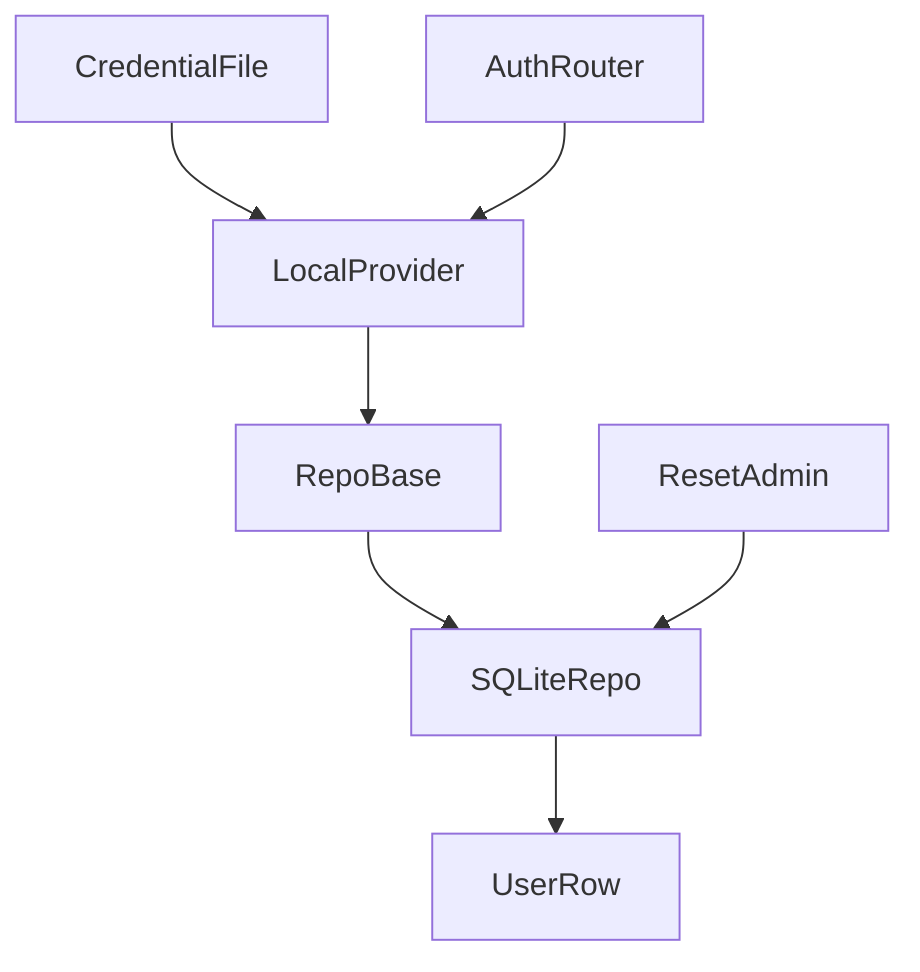
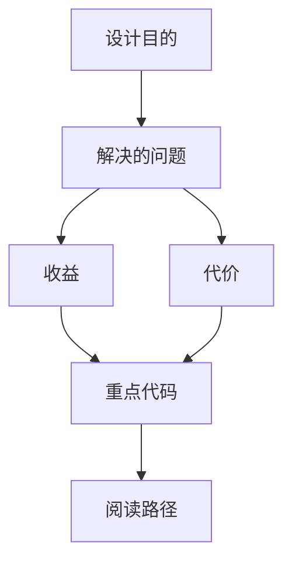

<title>288｜auth repository、credential_file、reset_admin 详解</title>

<callout emoji="✅">
**本章目标：**继续拆 auth/channel/frontend core 单文件模块。
</callout>

| 模块点 | 说明 |
|-|-|
| repositories/base.py | 用户 repo 抽象。 |
| repositories/sqlite.py | SQLite user repo。 |
| credential_file.py | 凭证文件读取。 |
| reset_admin.py | 重置 admin 工具。 |
| local_provider.py | 组合 repo 和认证逻辑。 |

---

# 补充：设计取舍、重点代码与阅读路径

<callout emoji="💡">
**设计目的：**该模块单独成章，是为了把职责边界、运行逻辑和维护入口从大系统中抽出来。
</callout>

| 维度 | 说明 |
|-|-|
| 收益 | 收益是学习和定位更聚焦。 |
| 代价 | 代价是章节数量更多，需要依赖目录维护。 |
| 重点代码 | 重点代码见本章列出的文件路径。 |
| 阅读路径 | 阅读路径：先看上游输入和下游输出，再读关键函数。 |

