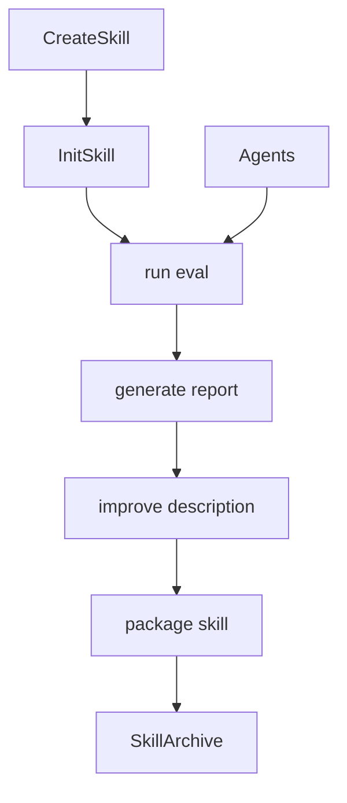
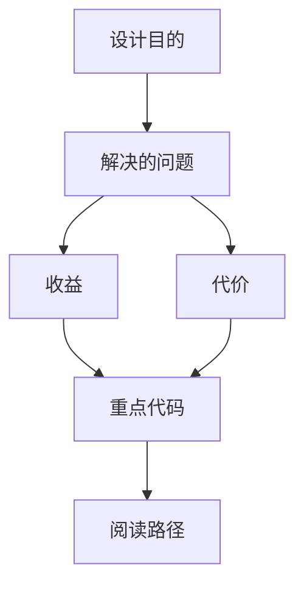

<title>319｜Skill Creator Scripts 单文件族详解</title>

<callout emoji="✅">
**本章目标：**继续拆更细 backend/frontend/skill scripts 模块。
</callout>

| 模块点 | 说明 |
|-|-|
| init_skill.py | 初始化 skill。 |
| run_eval.py | 运行评估。 |
| generate_report.py | 生成报告。 |
| improve_description.py | 优化描述。 |
| package_skill.py | 打包 skill。 |
| agents/\* | 分析/比较/评分子代理。 |

---

# 补充：设计取舍、重点代码与阅读路径

<callout emoji="💡">
**设计目的：**该模块承担 agent 扩展能力，是为了把工具、知识、长期上下文或执行环境做成可组合部件。
</callout>

| 维度 | 说明 |
|-|-|
| 收益 | 收益是可扩展、可配置、可替换。 |
| 代价 | 代价是配置、prompt、工具 schema、外部服务任一环节出错都会影响结果。 |
| 重点代码 | 重点代码在 `backend/packages/harness/deerflow` 下对应 skills/mcp/memory/sandbox/tools/models 模块。 |
| 阅读路径 | 阅读路径：明确它给 agent 增加了什么能力，以及该能力在哪里被注入。 |

