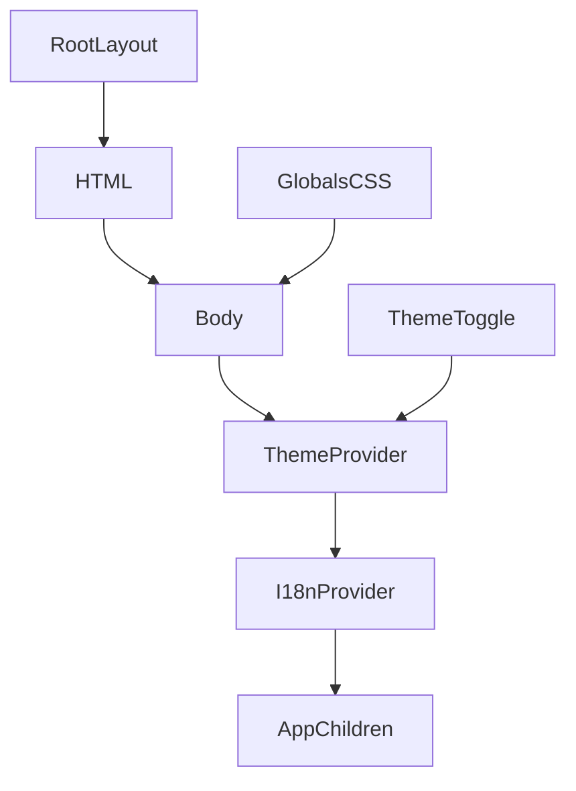
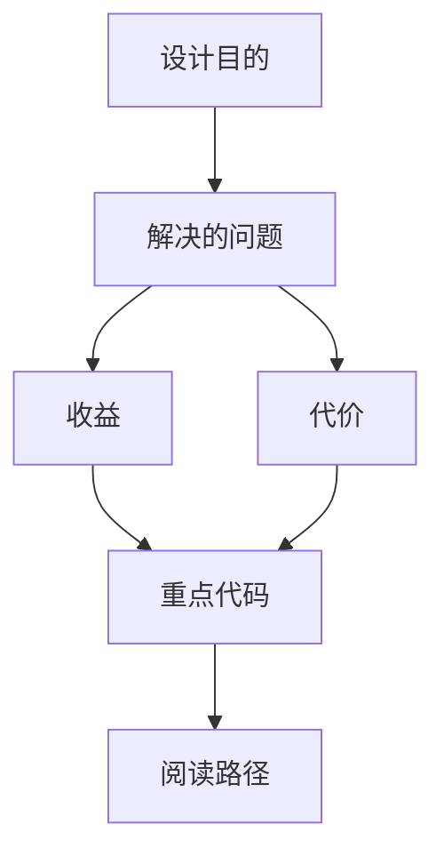

<title>348｜ThemeProvider 与 Global Layout 详解</title>

<callout emoji="✅">
**本章目标：**继续细化前端 UI/Landing/I18n 模块。
</callout>

| 模块点 | 说明 |
|-|-|
| theme-provider.tsx | next-themes wrapper。 |
| app/layout.tsx | RootLayout。 |
| globals.css | 全局样式。 |
| body/html | 主题和 hydration 设置。 |

---

# 补充：设计取舍、重点代码与阅读路径

<callout emoji="💡">
**设计目的：**该模块单独成章，是为了把职责边界、运行逻辑和维护入口从大系统中抽出来。
</callout>

| 维度 | 说明 |
|-|-|
| 收益 | 收益是学习和定位更聚焦。 |
| 代价 | 代价是章节数量更多，需要依赖目录维护。 |
| 重点代码 | 重点代码见本章列出的文件路径。 |
| 阅读路径 | 阅读路径：先看上游输入和下游输出，再读关键函数。 |

