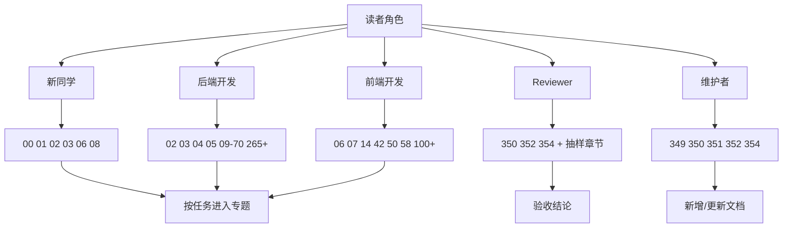
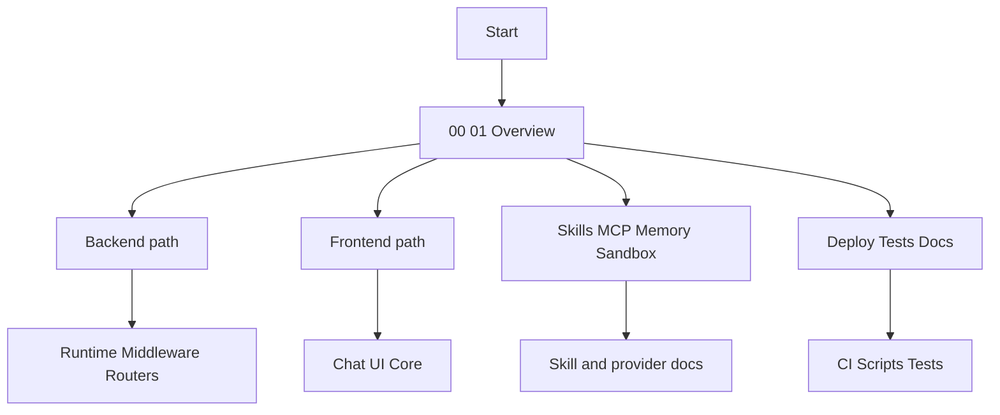
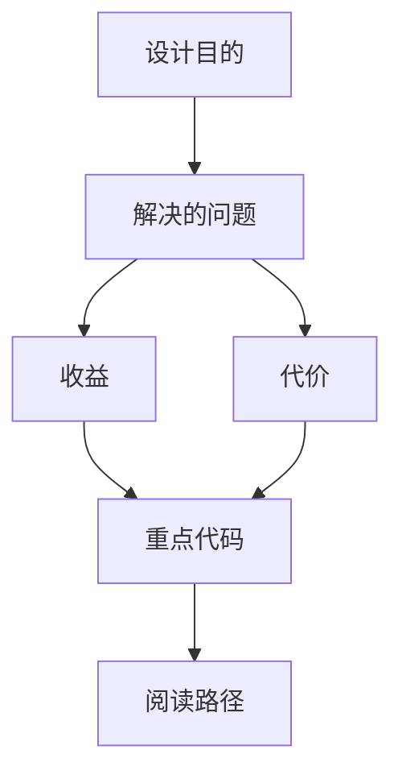

<title>349｜文档集导航指南：300+ 章节阅读路径</title>

<callout emoji="✅">
**本章目标：**为整个 DeerFlow 源码分层详解文档集提供阅读路径。
</callout>

---

# 可视化增强：多角色阅读路线图

<callout emoji="💡">
**图解目标：**补充面向新同学、开发者、Reviewer、维护者的阅读路线，提升导航文档本身的可视化价值。
</callout>

## 1. 多角色阅读路线图

| 读图对象 | 图里怎么看 | 维护入口 |
|-|-|-|
| 模块职责 | 把 300+ 章节转成按角色可选的路线 | 349、350、351、354 |
| 数据流 | 角色 → 推荐章节 → 深入专题 → 验收或维护动作 | 目录文档和章节链接 |
| 阅读路径 | 先选角色，再选主路线，再看专题章节 | 349 章节 |

| 阅读目标 | 推荐章节 |
|-|-|
| 新同学快速上手 | 00、01、02、03、06、08 |
| 后端运行时 | 02、03、11、12、21、51、52、265、266 |
| 前端聊天链路 | 06、14、42、50、58、129、300、301 |
| 扩展能力 | 05、39、40、41、70、78、79、139-166 |
| 部署测试 | 08、132-138、167-187、321-341 |

---

# 补充：设计取舍、重点代码与阅读路径

<callout emoji="💡">
**设计目的：**导航文档把 300+ 章节按读者目标重新分组，输入是章节清单和源码域，输出是可直接选择的后端、前端、扩展、部署测试阅读路线。
</callout>

| 维度 | 说明 |
|-|-|
| 收益 | 收益是新同学可以按任务选择最短路径；维护者可以检查章节覆盖是否遗漏主链路、配置链路或排障链路。 |
| 代价 | 代价是章节新增、重命名或拆分后必须同步更新推荐章节；主要风险是目录链接过期或某条路线只覆盖入口、不覆盖真实维护点。 |
| 重点代码 | 重点维护入口是飞书文件夹清单、00 目录文档、01-08 总览章节，以及 349/350/351/354 这些导航、覆盖矩阵、维护和验收文档。 |
| 阅读路径 | 阅读路径：先按“新同学快速上手”读 00/01/02/03/06/08，再按当前任务切到后端运行时、前端聊天链路、扩展能力或部署测试路线。 |

