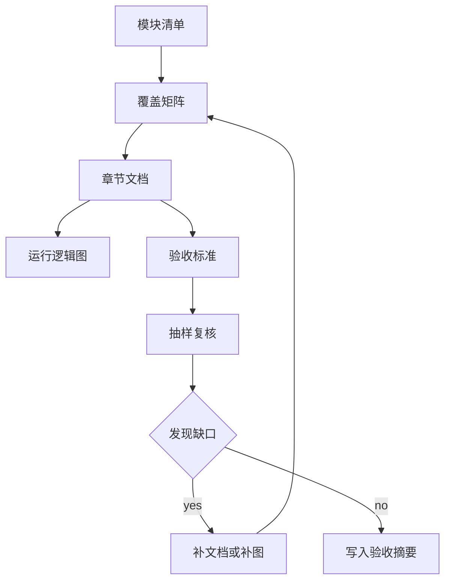
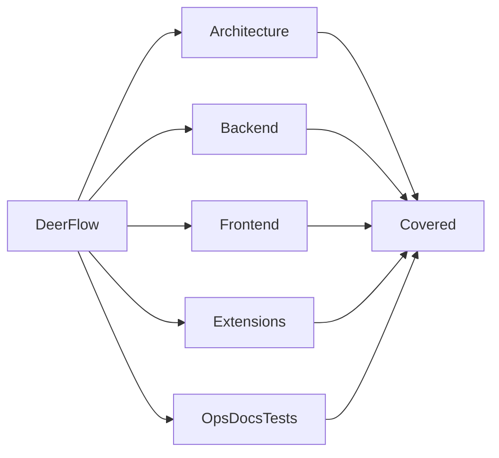
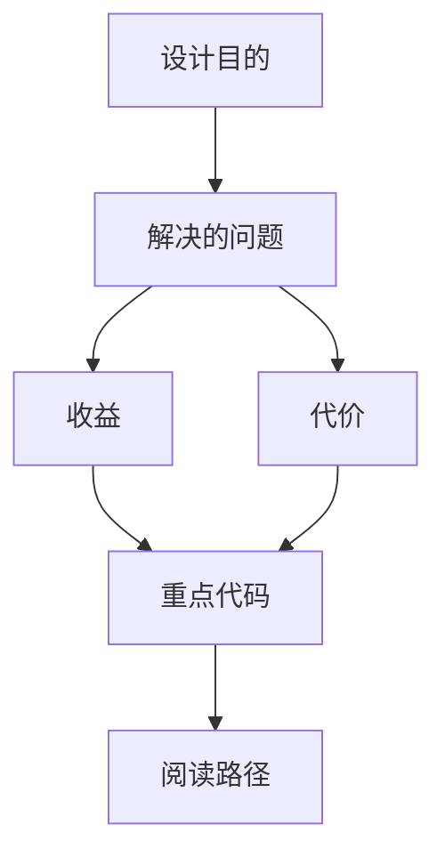

<title>350｜模块覆盖矩阵与验收说明</title>

<callout emoji="✅">
**本章目标：**总结当前文档集对 DeerFlow 各分层模块的覆盖情况。
</callout>

---

# 可视化增强：覆盖矩阵验收图

<callout emoji="💡">
**图解目标：**补充覆盖矩阵如何从模块清单到验收证据的流程。
</callout>

## 1. 覆盖矩阵验收流程

| 读图对象 | 图里怎么看 | 维护入口 |
|-|-|-|
| 模块职责 | 把覆盖范围、章节链接、验收点连起来 | 350 覆盖矩阵 |
| 数据流 | 模块清单进入矩阵，矩阵驱动抽查和补齐 | 350、354 |
| 阅读路径 | 先看覆盖，再看缺口，再看证据 | 350 章节 |

| 分层 | 覆盖章节范围 | 覆盖状态 |
|-|-|-|
| 整体架构 | 00-10 | 已覆盖 |
| Gateway/Runtime | 11-18、51-57、251-278 | 已覆盖 |
| Middleware | 19-36、24-36 | 已覆盖 |
| Frontend workspace/core | 42-50、58-67、100-131、293-348 | 已覆盖 |
| Skills/MCP/Memory/Sandbox | 37-41、70-89、139-166 | 已覆盖 |
| Tests/CI/Scripts/Docs | 132-138、167-250、314-341 | 已覆盖 |

---

# 补充：设计取舍、重点代码与阅读路径

<callout emoji="💡">
**设计目的：**该模块单独成章，是为了把职责边界、运行逻辑和维护入口从大系统中抽出来。
</callout>

| 维度 | 说明 |
|-|-|
| 收益 | 收益是学习和定位更聚焦。 |
| 代价 | 代价是章节数量更多，需要依赖目录维护。 |
| 重点代码 | 重点代码见本章列出的文件路径。 |
| 阅读路径 | 阅读路径：先看上游输入和下游输出，再读关键函数。 |

