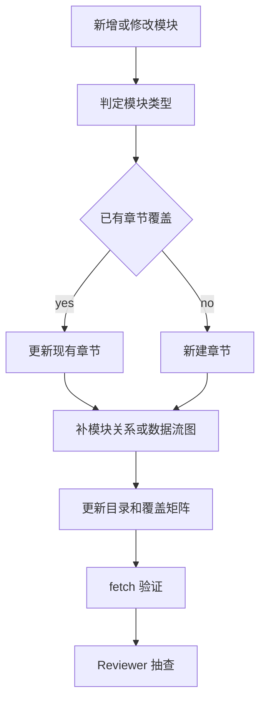
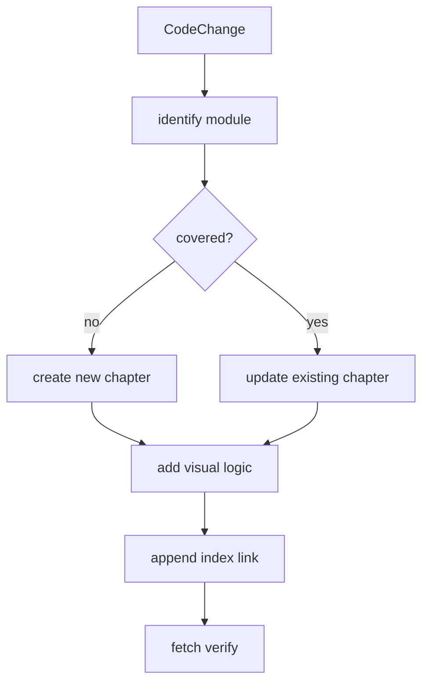
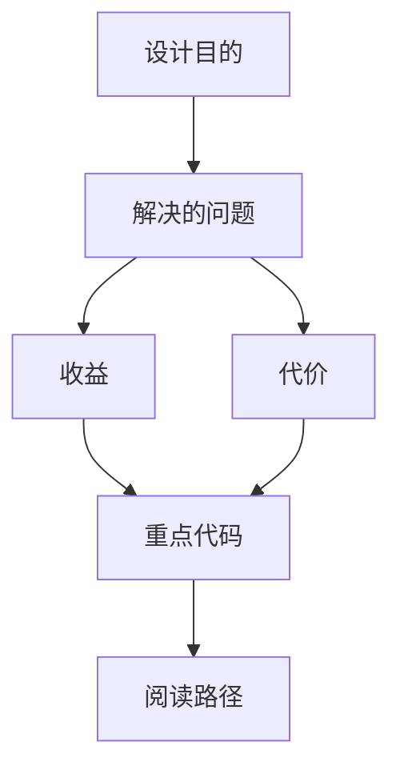

<title>351｜文档集维护指南：新增模块后的补文档方法</title>

<callout emoji="✅">
**本章目标：**说明后续 DeerFlow 新增模块后，如何延续“一模块一文档 + 可视化图”的规则。
</callout>

---

# 可视化增强：新增模块补文档流程图

<callout emoji="💡">
**图解目标：**补充新增模块时从代码变更到文档更新、图更新、目录更新的流程。
</callout>

## 1. 新增模块文档维护流程

| 读图对象 | 图里怎么看 | 维护入口 |
|-|-|-|
| 模块职责 | 把维护动作变成可执行流程 | 351 维护指南 |
| 数据流 | 代码变更推动章节、图、目录和矩阵同步更新 | 349、350、351、354 |
| 阅读路径 | 先分类，再决定更新/新建，最后验收 | 351 章节 |

| 变更类型 | 维护动作 |
|-|-|
| 新增后端文件 | 新增一篇对应模块文档，补运行图和关键函数表。 |
| 新增前端组件 | 补组件输入/状态/输出图。 |
| 新增测试 | 补测试目的、fixture、CI 关系。 |
| 新增 skill | 补 skill 目标、触发、工作流图。 |
| 新增配置 | 补配置到 runtime 的传播图。 |

---

# 补充：设计取舍、重点代码与阅读路径

<callout emoji="💡">
**设计目的：**该模块单独成章，是为了把职责边界、运行逻辑和维护入口从大系统中抽出来。
</callout>

| 维度 | 说明 |
|-|-|
| 收益 | 收益是学习和定位更聚焦。 |
| 代价 | 代价是章节数量更多，需要依赖目录维护。 |
| 重点代码 | 重点代码见本章列出的文件路径。 |
| 阅读路径 | 阅读路径：先看上游输入和下游输出，再读关键函数。 |

