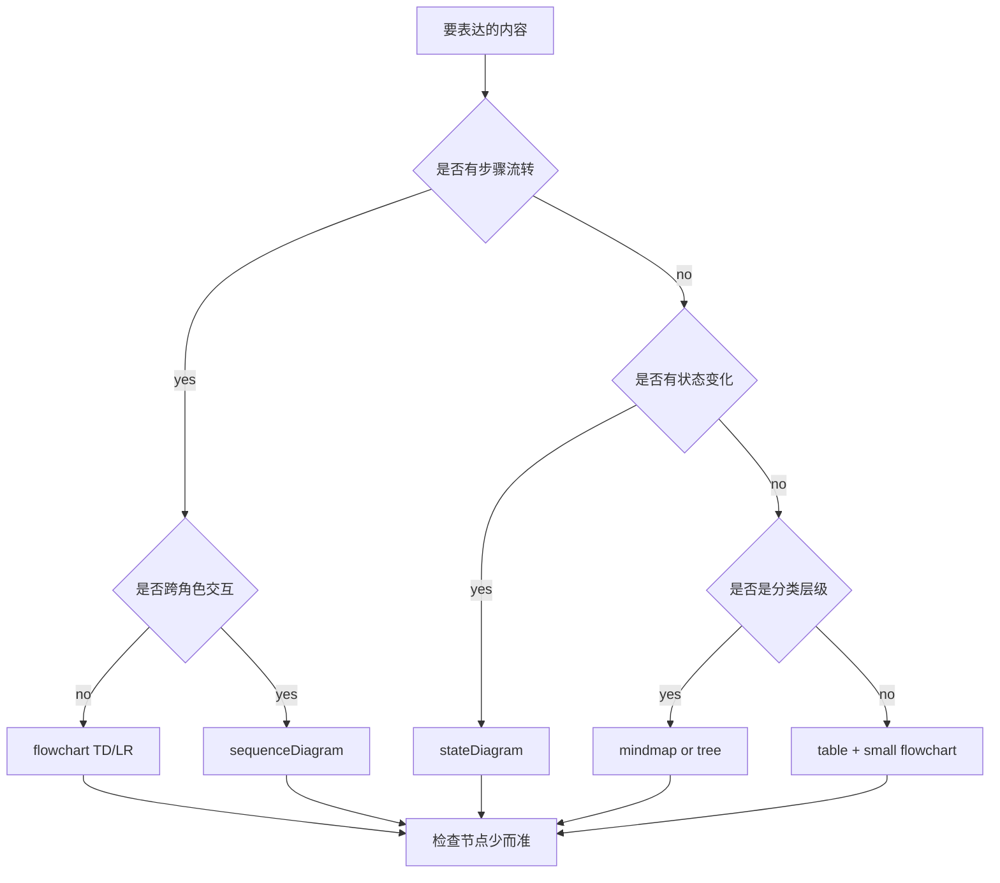
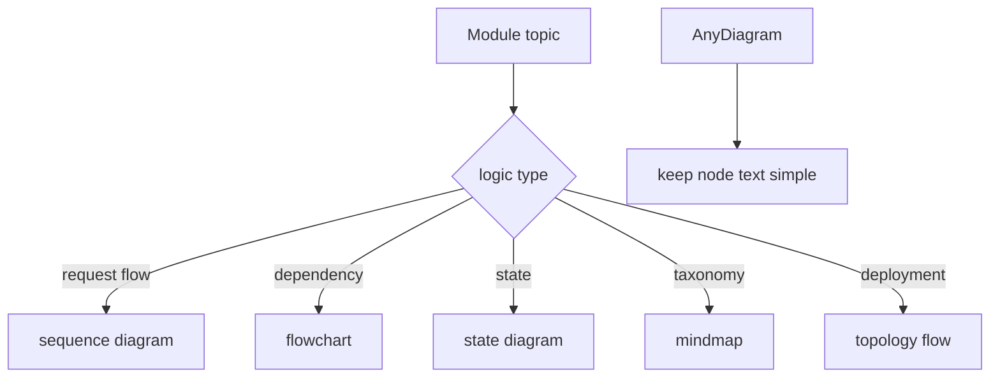
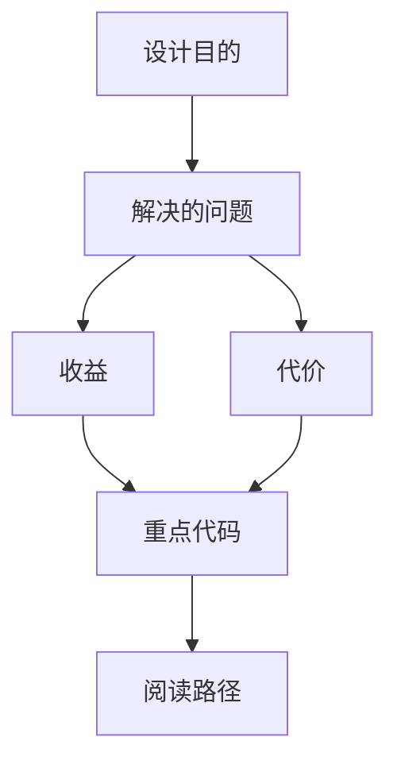

<title>352｜可视化风格指南：运行逻辑图绘制规范</title>

<callout emoji="✅">
**本章目标：**统一说明本项目文档中运行逻辑图的表达规范。
</callout>

---

# 可视化增强：图型选择决策图

<callout emoji="💡">
**图解目标：**补充如何按内容类型选择 Mermaid 图型，方便后续 355 篇复用。
</callout>

## 1. 可视化图型选择决策图

| 读图对象 | 图里怎么看 | 维护入口 |
|-|-|-|
| 模块职责 | 把“用什么图”标准化 | 352 风格指南 |
| 数据流 | 内容类型决定图型，再进入节点简化和验收 | Mermaid/whiteboard |
| 阅读路径 | 先判断内容，再选图型，再检查可读性 | 352 章节 |

| 场景 | 推荐图 |
|-|-|
| 请求/响应链路 | sequenceDiagram |
| 模块依赖 | flowchart TD/LR |
| 状态流转 | stateDiagram |
| 分类/层级 | mindmap 或 flowchart |
| 部署拓扑 | flowchart LR |

---

# 补充：设计取舍、重点代码与阅读路径

<callout emoji="💡">
**设计目的：**该模块单独成章，是为了把职责边界、运行逻辑和维护入口从大系统中抽出来。
</callout>

| 维度 | 说明 |
|-|-|
| 收益 | 收益是学习和定位更聚焦。 |
| 代价 | 代价是章节数量更多，需要依赖目录维护。 |
| 重点代码 | 重点代码见本章列出的文件路径。 |
| 阅读路径 | 阅读路径：先看上游输入和下游输出，再读关键函数。 |

