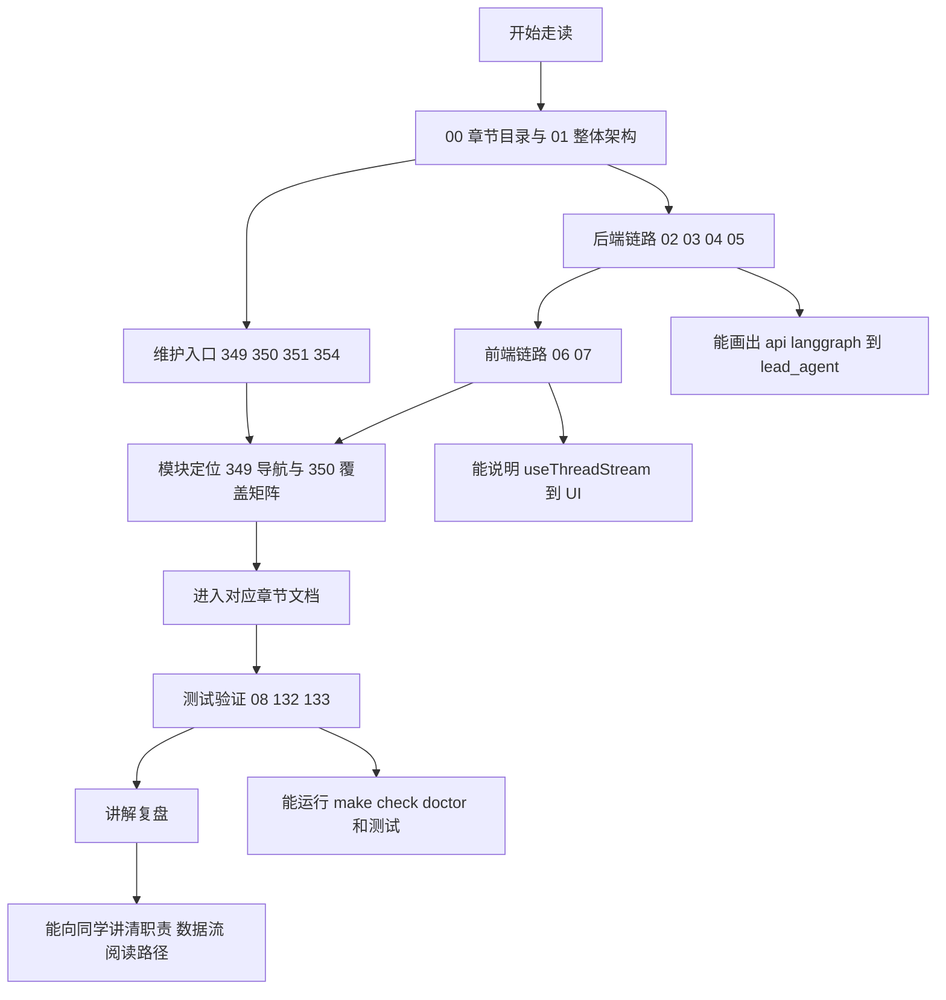
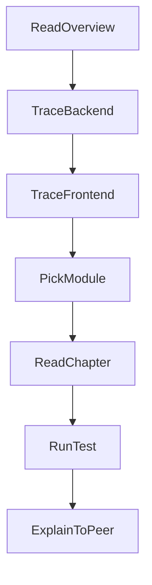
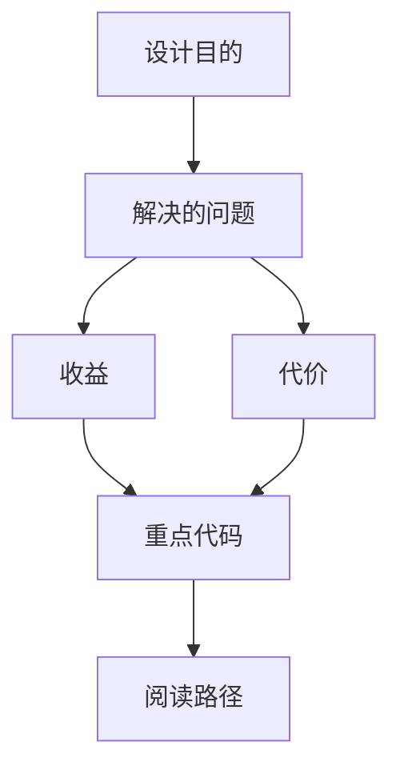

<title>353｜新同学源码走读检查清单</title>

<callout emoji="✅">
**本章目标：**给新同学一份可打勾的学习和验收清单。
</callout>

---

# 可视化增强：新同学走读验收路线图

<callout emoji="💡">
**图解目标：**把新同学从“先看哪篇”到“如何讲清楚”的验收路线串起来：先建立 00/01 总览，再分后端链路、前端链路、模块定位、测试验证，最后完成讲解复盘。
</callout>

## 1. 新同学源码走读验收路线图

| 读图对象 | 图里怎么看 | 维护入口 |
|-|-|-|
| 新同学 | 按 00/01 总览 → 后端链路 → 前端链路 → 模块定位 → 测试验证 → 讲解复盘的顺序打勾。 | 00、01、02、03、04、05、06、07、08、132、133。 |
| 带教 / Reviewer | 用图中的 Check1/Check2/Check3 判断新同学是否真正理解请求链路、前端状态流和验证方法。 | 349 导航、350 覆盖矩阵、354 验收摘要。 |
| 文档维护者 | 新增模块时从 351 维护指南进入，确认模块是否已有章节、是否补了关系图/数据流图/阅读路径。 | 349、350、351、354 与对应核心章节。 |

- [ ] 能从 00/01 讲清 DeerFlow 分层。

- [ ] 能画出 /api/langgraph 到 lead_agent 的请求链路。

- [ ] 能解释 ThreadData、Uploads、Sandbox、ToolOutputBudget 的职责。

- [ ] 能解释 useThreadStream 如何驱动前端 UI。

- [ ] 能找到某个 router、middleware、frontend component 的对应文档。

- [ ] 能运行 make check / make doctor / backend tests / frontend tests。

---

# 补充：设计取舍、重点代码与阅读路径

<callout emoji="💡">
**设计目的：**该模块单独成章，是为了把职责边界、运行逻辑和维护入口从大系统中抽出来。
</callout>

| 维度 | 说明 |
|-|-|
| 收益 | 收益是学习和定位更聚焦。 |
| 代价 | 代价是章节数量更多，需要依赖目录维护。 |
| 重点代码 | 重点代码见本章列出的文件路径。 |
| 阅读路径 | 阅读路径：先看上游输入和下游输出，再读关键函数。 |

