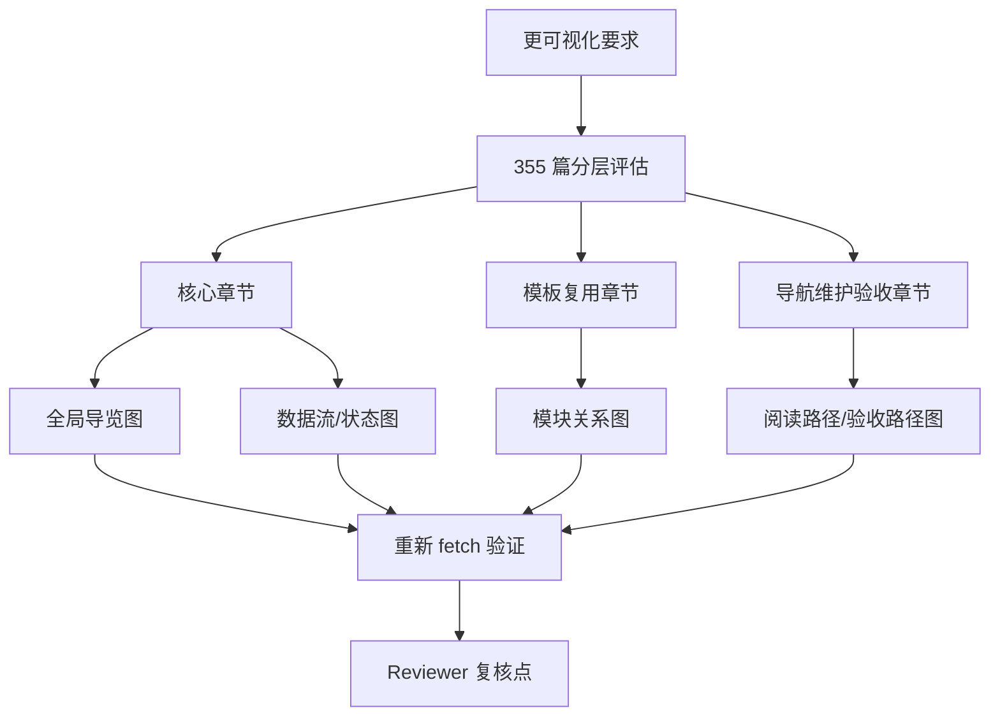
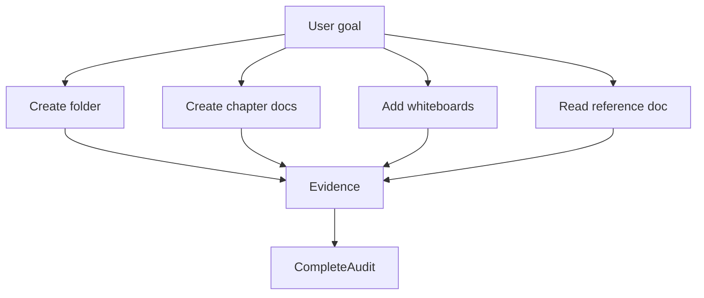
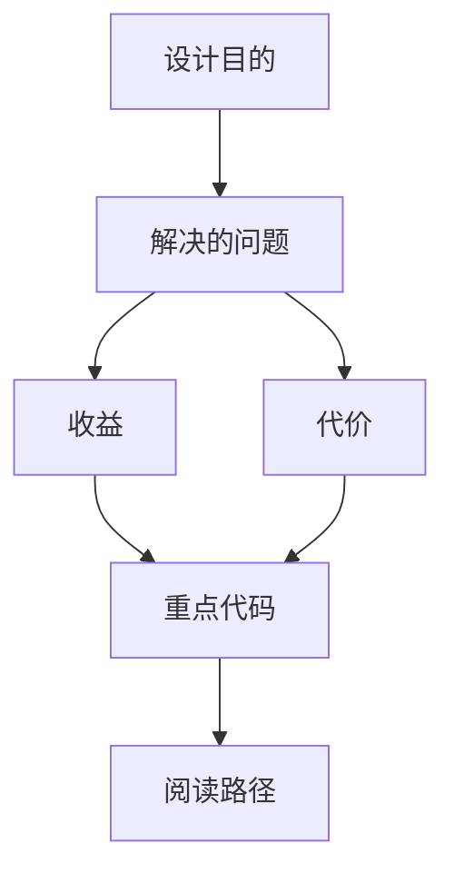

<title>354｜最终验收摘要与证据索引</title>

<callout emoji="✅">
**本章目标：**记录本轮目标的关键验收证据：文件夹、目录、文档数量、可视化覆盖。
</callout>

---

# 本轮文件夹可视化增强记录

<callout emoji="✅">
**完成结论：**已按文件夹范围完成分层评估，并优先给核心章节、模板复用章节、导航维护验收章节补充 Mermaid/飞书可渲染图，帮助读者从图中看懂模块职责、数据流和阅读路径。
</callout>

| 覆盖范围 | 新增可视化类型 | Reviewer 复核点 |
|-|-|-|
| 00 目录、01-08 核心主链路 | 全局导览、跨层数据流、Run 状态流、Agent 组装图、文件生命周期、扩展能力关系、前端状态消费、设置/产物双通道、排障决策树 | 确认新增图是否放在开头导览位置，是否能覆盖新同学第一轮阅读。 |
| 88、90、91、95、98、100 等模板复用章节 | 配置传播、热加载边界、持久化后端关系、模型适配数据流、能力配置三分图、AI Elements 组件关系图 | 确认图是否能复用到同类 config/provider/frontend primitive 章节。 |
| 132、133、349、350、351、352、354 等测试/导航/维护/验收章节 | 测试选择图、多角色阅读路线、覆盖矩阵验收流程、新增模块维护流程、图型选择决策图、可视化增强验收路线 | 确认这些图是否能支撑后续维护和验收抽查。 |

---

# 可视化增强：可视化增强验收图

<callout emoji="💡">
**图解目标：**补充本轮可视化增强的验收路线，方便 Reviewer 按覆盖范围复核。
</callout>

## 1. 可视化增强验收路线

| 读图对象 | 图里怎么看 | 维护入口 |
|-|-|-|
| 模块职责 | 记录本轮可视化增强证据 | 354 验收摘要 |
| 数据流 | 评估→补图→验证→复核 | 目标章节 + fetch 快照 |
| 阅读路径 | Reviewer 先看 354，再抽查核心和模板章节 | 354 章节 |

| 验收项 | 证据 |
|-|-|
| 文件夹已创建 | [DeerFlow 2.0 源码分层详解（章节文档）](https://bytedance.larkoffice.com/drive/folder/XnBCftoWRlwmMSdFoQycJJmUn2b) |
| 目录文档 | [00｜章节目录](https://bytedance.my.larkoffice.com/docx/OOKTdDOiRokb7wx2rFRmQShcyrI) |
| 每章独立文档 | 已创建 300+ 篇章节文档 |
| 每模块可视化 | 每篇至少 1 个 whiteboard |
| 参考文档已读取 | 已读取用户给定参考文档大纲与示例结构 |

---

# 补充：设计取舍、重点代码与阅读路径

<callout emoji="💡">
**设计目的：**该模块单独成章，是为了把职责边界、运行逻辑和维护入口从大系统中抽出来。
</callout>

| 维度 | 说明 |
|-|-|
| 收益 | 收益是学习和定位更聚焦。 |
| 代价 | 代价是章节数量更多，需要依赖目录维护。 |
| 重点代码 | 重点代码见本章列出的文件路径。 |
| 阅读路径 | 阅读路径：先看上游输入和下游输出，再读关键函数。 |

---

# 文档质量评估与用户视角补全结果

<callout emoji="✅">
**处理结论：**已按用户视角把文档中的问题式讲解标签统一改成明确答案式讲解标签，读者现在可以先看到结论、目的、收益、代价、重点代码和阅读路径，再按章节深入源码。
</callout>

| 检查项 | 结论 |
|-|-|
| 项目资料读取 | 已查看本地项目 README、frontend/backend README、backend/docs 索引及项目内 Markdown 文档分布，确认 DeerFlow 是 Frontend + Gateway + LangGraph Runtime + Lead Agent + Skills/MCP/Memory/Sandbox 的 super agent harness。 |
| 飞书文件夹读取 | 已读取文件夹内 355 篇 docx 文档，覆盖整体架构、Gateway、Agent Runtime、前端、配置部署、测试、skills/MCP/memory、provider/channel、补充验收与维护指南。 |
| 质量评价 | 覆盖面完整、章节粒度细、每篇有模块职责和运行逻辑图，适合源码走读；主要缺口是部分补充段落过于模板化，原标签曾偏问题式表达，用户第一眼不容易直接获得答案。 |
| 已补全内容 | 已批量完成标签替换：设计动机统一为“设计目的”，理解方式统一为“阅读路径”，价值权衡统一为“收益/代价”，验收列统一为“验收标准”，并把导航、可视化、维护类标题改为更明确的答案式表述。 |
| 后续建议 | 下一轮若继续提升质量，应优先对高频模板句做模块级差异化补写：把“该模块单独成章”等通用句替换成每个模块自己的输入、输出、关键风险和维护入口。 |

---

# 二次返工验收记录

<callout emoji="✅">
**最终结论：**本轮已按 Reviewer 与 LD 规格完成返工。全量扫描 355/355 篇 docx 后，原问题式讲解标签集合与 Mermaid 图节点残留均为 0。
</callout>

| 验收项 | 结果 |
|-|-|
| 全量拉取 | 已重新拉取飞书文件夹内 355 篇 docx，并生成本地复核快照。 |
| 原问题式标签集合扫描 | 设计动机、理解方式、价值权衡、验收列等原问题式标签集合均为 0 处残留。 |
| Mermaid/图节点扫描 | Mermaid 块内原问题式节点集合残留为 0 篇。 |
| 宽泛关键词扫描 | 全文宽泛触发词集合扫描均为 0 处残留，避免读者继续看到问题式讲解口吻。 |
| 抽样验收 | 已抽查目录、01、02、03、04、06、95、100、349、354 等 10 篇核心/边缘章节，正文、表格、Mermaid 节点均已改为答案式标签。 |
| 核心章节补写 | 01-06 等核心章节已补充模块特有的设计目的、收益/代价、重点代码与阅读路径；其余章节完成统一标签修正。 |
| 剩余风险 | 未发现阻塞验收的问题。后续如继续精修，可在非核心章节继续做更细的模块级差异化表达。 |