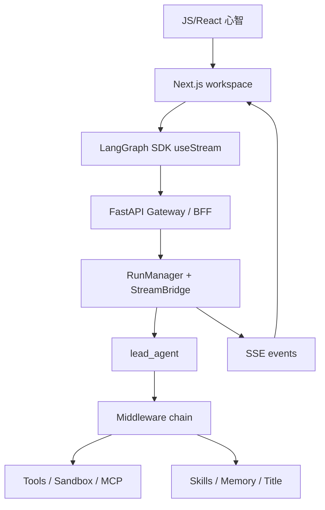
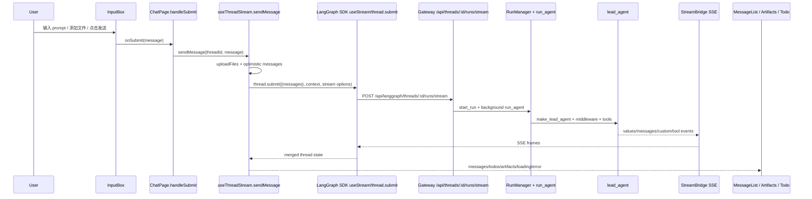

<title>355｜只会 JS 的前端学习 DeerFlow 路线图</title>

<callout emoji="💡">
**读者定位：**你会 JavaScript/React，但不熟 Python、FastAPI、LangGraph、Agent Runtime。本文把 DeerFlow 当成一个 **Next.js App Router / React workspace + Gateway/BFF + Agent Runtime** 来读：先用前端心智建立地图，再沿着一条真实消息链路进入后端。
</callout>

---

# 0. 先把 DeerFlow 翻译成前端能理解的语言

| DeerFlow 概念 | 先类比成前端里的什么 | 深入时要修正的点 |
|-|-|-|
| `frontend/` | Next.js App Router + React workspace | 不只是 UI：它通过 LangGraph SDK 订阅 thread/run stream，并渲染 message、artifact、todo、subtask。 |
| `backend/app/gateway/` | BFF / API Routes / Node 服务层 | 这里用 Python FastAPI 写，承接认证、上传、线程、run、模型、skills、memory、artifacts 等 API。 |
| `/api/langgraph/*` | 浏览器侧统一 chat/run streaming API | nginx 会把它 rewrite 到 Gateway 的 `/api/*`；不是单独的 LangGraph 服务。 |
| `RunManager` | run 状态机 / 后台任务管理器 | 负责创建、拒绝/中断冲突 run、记录状态、对接后台 worker。 |
| `StreamBridge` | EventEmitter / ReadableStream / SSE buffer | 后台 worker publish 事件，HTTP SSE consumer 读事件并发回前端。 |
| `lead_agent` | 会调用工具的业务编排器 | 它是 LangGraph/LangChain agent，由 model、prompt、tools、middleware、state schema 组成。 |
| Middleware | 请求拦截器 / Provider / Express middleware | DeerFlow middleware 处理 agent 上下文、线程目录、上传文件、sandbox、skills、memory、title、token usage、安全等横切逻辑。 |
| Sandbox | iframe / Web Worker / 临时 workspace | 隔离 agent 可读写的线程文件系统和命令执行环境。 |
| Skills / MCP / Memory | 插件系统 + 外部工具 + 用户偏好缓存 | 它们会进入 prompt、tool schema、hidden context 或 runtime context。 |

---

# 1. 最短主线：从输入框追到后端再回到 MessageList

<callout emoji="✅">
**先记住正确链路：**不是 `use-thread-chat` 提交消息。真实提交链路是 `InputBox -> ChatPage.handleSubmit -> useThreadStream.sendMessage -> LangGraph SDK thread.submit -> Gateway stream route -> RunManager/run_agent -> StreamBridge -> useStream state -> MessageList`。
</callout>

| 步骤 | 关键文件 | 你要读懂什么 |
|-|-|-|
| 页面装配 | `frontend/src/app/workspace/chats/[thread_id]/page.tsx` | ChatPage 组合 `useThreadChat`、`useThreadSettings`、`useThreadStream`、`MessageList`、`InputBox`、`ArtifactTrigger`、`TodoList`。 |
| 路由状态 | `frontend/src/components/workspace/chats/use-thread-chat.ts` | 只负责从 URL 派生 `threadId`、`isNewThread`、`isMock`，并处理 `/new` 的临时 UUID；**不负责提交消息**。 |
| 输入框 | `frontend/src/components/workspace/input-box.tsx` | 校验文本/文件、stop streaming、模型自动选择，最后触发 `onSubmit`。 |
| stream hook | `frontend/src/core/threads/hooks.ts` | `useThreadStream` 创建 LangGraph SDK `useStream`，并在 `sendMessage` 中上传文件、创建 optimistic messages、调用 `thread.submit`。 |
| SDK client | `frontend/src/core/api/api-client.ts`、`frontend/src/core/config/index.ts` | `getLangGraphBaseURL()` 默认是浏览器当前 origin 的 `/api/langgraph`；mock 模式走 `/mock/api`。 |
| Gateway stream | `backend/app/gateway/routers/thread_runs.py` | `POST /api/threads/{thread_id}/runs/stream` 创建 run 并返回 SSE。 |
| run service | `backend/app/gateway/services.py` | `start_run()` 校验模型/权限、构造 config/context、调 `RunManager.create_or_reject()` 并启动后台 task。 |
| runtime worker | `backend/packages/harness/deerflow/runtime/runs/worker.py` | `run_agent()` 发布 metadata，构造 Runtime，调用 agent `astream`，把事件发给 StreamBridge。 |
| agent factory | `backend/packages/harness/deerflow/agents/lead_agent/agent.py` | `make_lead_agent()` 组装模型、prompt、tools、middleware、skills、state schema。 |

---

# 2. `/workspace/chats/new` 生命周期

| 关键点 | 说明 |
|-|-|
| 临时 ID | `/new` 页面会生成一个本地 UUID，用于 UI 展示和乐观状态。 |
| 不提前拉 history | `isNewThread` 为 true 时，`useThreadStream` 会避免把临时 ID 当作真实后端 thread 拉历史。 |
| `onSend` | 主要让欢迎页布局切换，不等于真实后端 thread 已创建。 |
| `onStart` | 后端 run 创建后拿到真实 `createdThreadId`，ChatPage 用 `history.replaceState` 把 URL 替换为 `/workspace/chats/{id}`。 |
| Next.js caveat | `replaceState` 不一定立刻刷新 `useParams`，所以 `useThreadChat` 有保护逻辑，避免继续传播 \` |