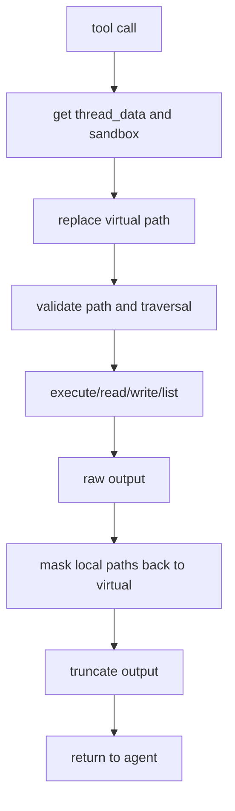
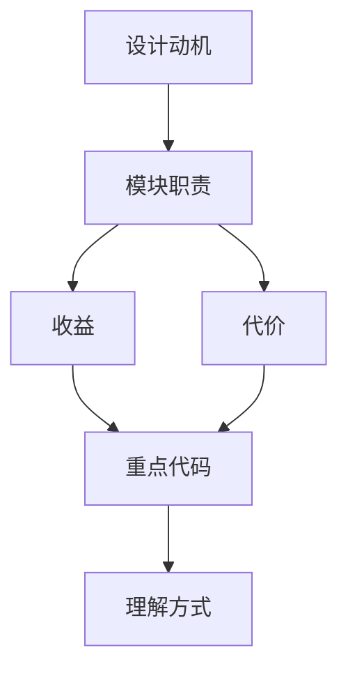

<title>37｜Sandbox Tools 单文件详解：bash/ls/glob/grep/read/write/str_replace</title>

<callout emoji="✅">
**本章目标：**讲清 sandbox/tools.py 中每个工具如何校验路径、替换虚拟路径、执行并截断输出。
</callout>

| 工具 | 职责 |
|-|-|
| `bash` | 执行命令，LocalSandbox 下校验 host bash 和绝对路径。 |
| `ls` | 列目录并截断输出。 |
| `glob` | 按模式找文件，限制结果数。 |
| `grep` | 全文搜索，跳过二进制和忽略路径。 |
| `read_file` | 读取文件并截断过长内容。 |
| `write_file` | 写入/追加文件，限制单次写入大小。 |
| `str_replace` | 读改写串行化，避免并发写冲突。 |

---

# 补充：设计取舍、重点代码与阅读路径

<callout emoji="💡">
**设计目的：**这个模块单独成章，是为了把职责边界、运行逻辑和维护入口从大系统里抽出来。
</callout>

| 维度 | 说明 |
|-|-|
| 收益 | 收益是查找和学习更快，职责更聚焦。 |
| 代价 | 代价是章节数量增加，需要依赖目录和索引维护。 |
| 重点代码 | 重点代码见本章表格列出的源码路径。 |
| 阅读路径 | 阅读路径：先确认它在系统链路中的上游和下游，再看关键函数。 |

