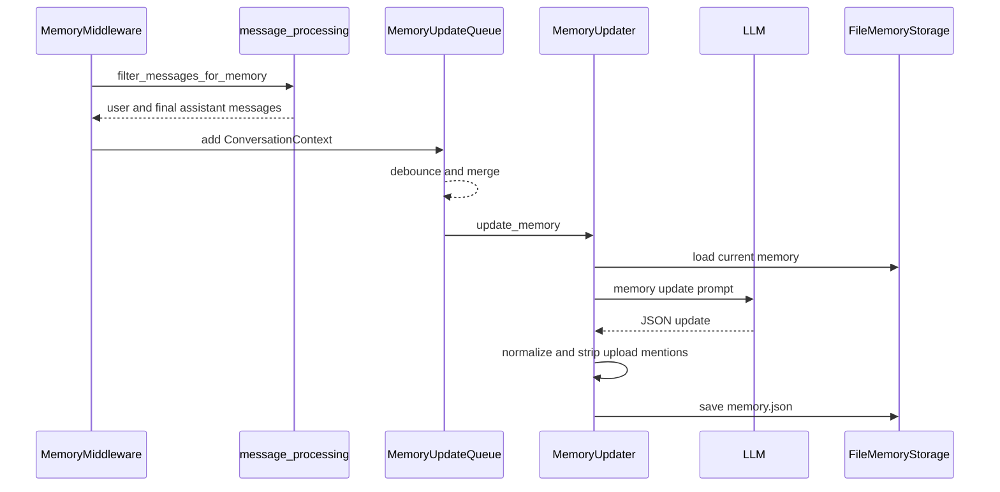
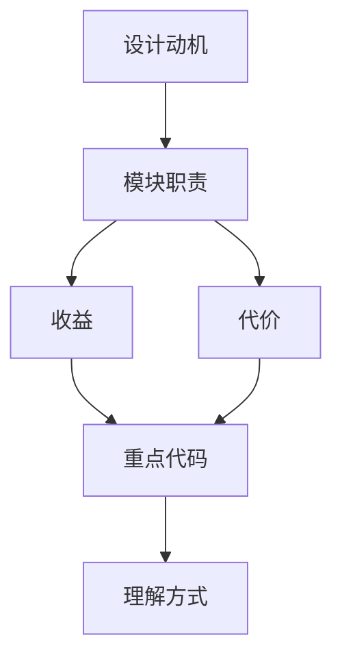

<title>40｜Memory Queue、Updater、Storage 单文件详解</title>

<callout emoji="✅">
**本章目标：**讲清 memory 从对话过滤、入队 debounce、LLM 更新、文件存储的完整链路。
</callout>

| 文件 | 职责 |
|-|-|
| `message_processing.py` | 抽取文本、过滤消息、检测纠正/强化。 |
| `queue.py` | ConversationContext、debounce、后台更新队列。 |
| `updater.py` | 构造更新 prompt、解析 JSON、归一化、应用更新。 |
| `storage.py` | FileMemoryStorage 读写 memory.json。 |
| `prompt.py` | format_memory_for_injection 和 conversation update prompt。 |

---

# 补充：设计取舍、重点代码与阅读路径

<callout emoji="💡">
**设计目的：**这些模块负责扩展 agent 能力：skill 提供方法论，MCP 提供外部工具，memory 提供长期上下文。
</callout>

| 维度 | 说明 |
|-|-|
| 收益 | 收益是能力可扩展、可配置、可跨会话复用。 |
| 代价 | 代价是 prompt、工具、记忆三者都会影响模型行为，问题定位需要分层排查。 |
| 重点代码 | 重点代码在 `backend/packages/harness/deerflow/skills`、`mcp`、`agents/memory`。 |
| 阅读路径 | 阅读路径：把 skill 当说明书，MCP 当工具注册表，memory 当上下文注入源。 |

