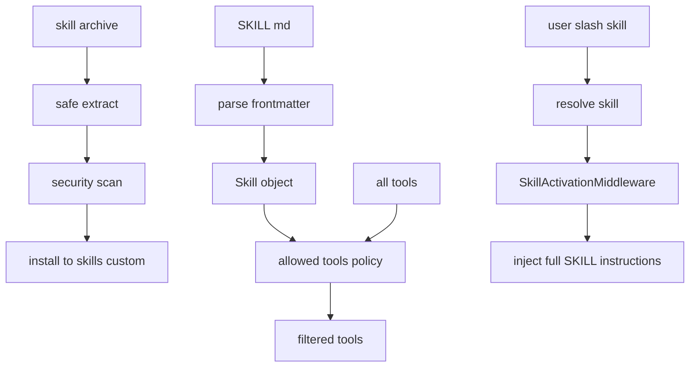
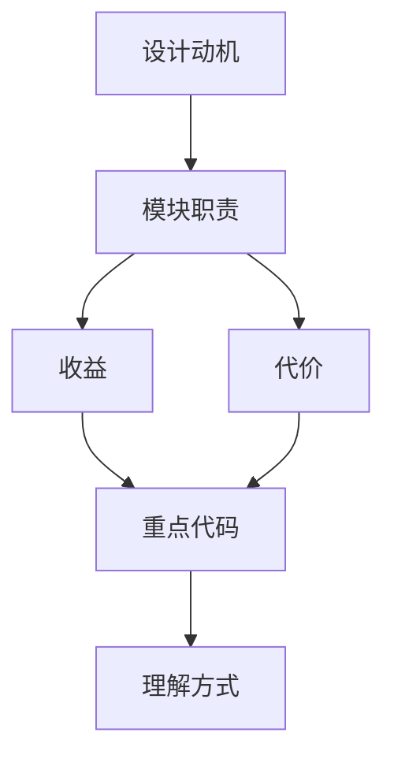

<title>41｜Skills Parser、Installer、Security Scanner 详解</title>

<callout emoji="✅">
**本章目标：**讲清 skill 从 SKILL.md 解析、压缩包安装、安全扫描到 allowed_tools 过滤的完整链路。
</callout>

| 文件 | 职责 |
|-|-|
| `skills/parser.py` | 解析 frontmatter、description、allowed_tools。 |
| `skills/installer.py` | 安全解压 .skill、扫描、移动到目标目录。 |
| `skills/security_scanner.py` | 用 LLM/规则扫描 skill 内容风险。 |
| `skills/tool_policy.py` | 根据 skill allowed_tools 过滤可用工具。 |
| `skills/slash.py` | 解析 /skill-name 显式激活。 |

## 补充：Skills 安装与激活简化运行图

---

# 补充：设计取舍、重点代码与阅读路径

<callout emoji="💡">
**设计目的：**前端模块按页面、core hooks、组件拆分，是为了分离路由装配、数据状态和展示组件。
</callout>

| 维度 | 说明 |
|-|-|
| 收益 | 收益是组件复用和状态管理更清晰。 |
| 代价 | 代价是一次交互会跨 React Query、localStorage、useStream 和多个组件。 |
| 重点代码 | 重点代码在 `frontend/src/app`、`frontend/src/core`、`frontend/src/components/workspace`。 |
| 阅读路径 | 阅读路径：先找页面入口，再找 hook 数据源，最后看组件如何消费 props/state。 |

