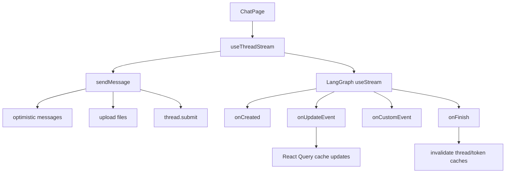
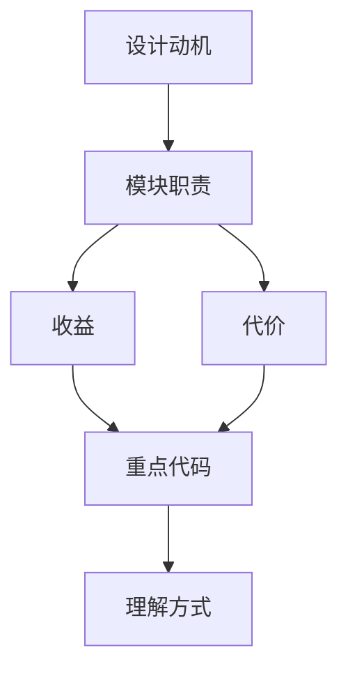

<title>42｜Frontend useThreadStream 单文件详解</title>

<callout emoji="✅">
**本章目标：**讲清 frontend/src/core/threads/hooks.ts 如何封装 LangGraph useStream、提交消息、处理历史和缓存。
</callout>

| 区域 | 职责 |
|-|-|
| `useThreadStream` | 核心 streaming hook，封装 useStream callbacks。 |
| `sendMessage` | 乐观 UI、文件上传、thread.submit。 |
| `mergeMessages` | 合并 optimistic/history/stream messages。 |
| `useThreadHistory` | 分页读取历史 run messages。 |
| `useInfiniteThreads` | 会话列表无限滚动。 |
| `useDeleteThread/useRenameThread` | 线程删除和重命名。 |

---

# 补充：设计取舍、重点代码与阅读路径

<callout emoji="💡">
**设计目的：**前端模块按页面、core hooks、组件拆分，是为了分离路由装配、数据状态和展示组件。
</callout>

| 维度 | 说明 |
|-|-|
| 收益 | 收益是组件复用和状态管理更清晰。 |
| 代价 | 代价是一次交互会跨 React Query、localStorage、useStream 和多个组件。 |
| 重点代码 | 重点代码在 `frontend/src/app`、`frontend/src/core`、`frontend/src/components/workspace`。 |
| 阅读路径 | 阅读路径：先找页面入口，再找 hook 数据源，最后看组件如何消费 props/state。 |

