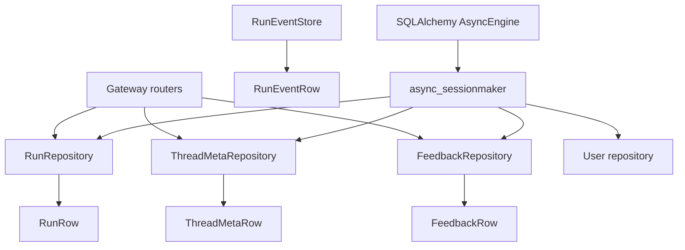
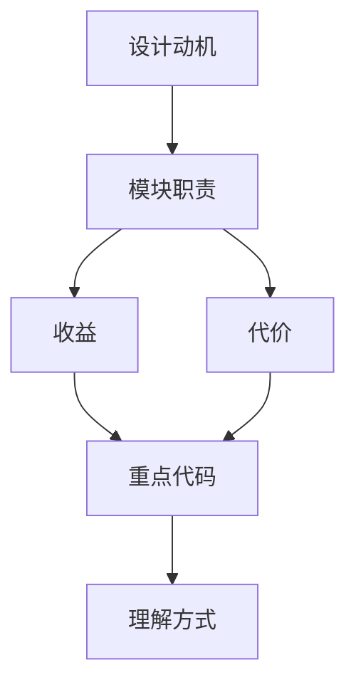

<title>46｜Persistence Repository 文件详解</title>

<callout emoji="✅">
**本章目标：**把 run/thread_meta/feedback/user/run_event 持久化表与 repository 职责讲清。
</callout>

| 模块 | 文件 | 职责 |
|-|-|-|
| Run | `persistence/run/model.py`、`sql.py` | RunRow 和 RunRepository。 |
| ThreadMeta | `persistence/thread_meta/model.py`、`sql.py` | 线程标题、状态、metadata、搜索。 |
| Feedback | `persistence/feedback/model.py`、`sql.py` | run feedback CRUD 和统计。 |
| User | `persistence/user/model.py` | 本地用户表。 |
| RunEvent | `persistence/models/run_event.py` | run event / message event 持久化。 |

---

# 补充：设计取舍、重点代码与阅读路径

<callout emoji="💡">
**设计目的：**前端模块按页面、core hooks、组件拆分，是为了分离路由装配、数据状态和展示组件。
</callout>

| 维度 | 说明 |
|-|-|
| 收益 | 收益是组件复用和状态管理更清晰。 |
| 代价 | 代价是一次交互会跨 React Query、localStorage、useStream 和多个组件。 |
| 重点代码 | 重点代码在 `frontend/src/app`、`frontend/src/core`、`frontend/src/components/workspace`。 |
| 阅读路径 | 阅读路径：先找页面入口，再找 hook 数据源，最后看组件如何消费 props/state。 |

