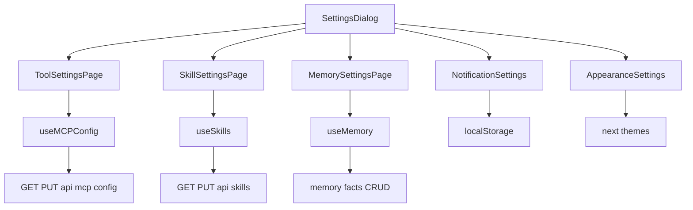
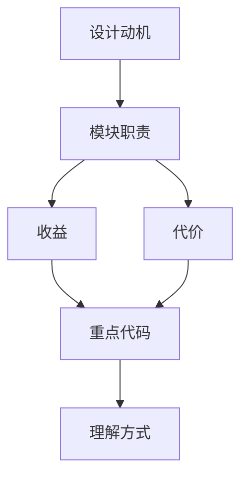

<title>47｜Frontend Settings 页面文件详解</title>

<callout emoji="✅">
**本章目标：**把 SettingsDialog 和各 settings page 的职责、数据来源和 mutation 流程讲清。
</callout>

| 页面文件 | 职责 | 数据源 |
|-|-|-|
| `settings-dialog.tsx` | 设置弹窗总入口和 section 切换 | local UI state |
| `tool-settings-page.tsx` | MCP server 列表和 enabled 开关 | `/api/mcp/config` |
| `skill-settings-page.tsx` | skills 列表、启停、创建 skill 入口 | `/api/skills` |
| `memory-settings-page.tsx` | memory summaries/facts、CRUD、导入导出 | `/api/memory` |
| `notification-settings-page.tsx` | 通知偏好 | localStorage |
| `appearance-settings-page.tsx` | 主题外观 | localStorage/theme |

---

# 补充：设计取舍、重点代码与阅读路径

<callout emoji="💡">
**设计目的：**这个模块采用 router/API 分层，是为了把 HTTP 边界、鉴权、请求响应模型和内部服务逻辑分开。
</callout>

| 维度 | 说明 |
|-|-|
| 收益 | 收益是接口职责清晰，前端和外部 SDK 可稳定调用。 |
| 代价 | 代价是一次业务流常跨 router、service、runtime、repository 多层。 |
| 重点代码 | 重点代码在 `backend/app/gateway/routers/` 与 `backend/app/gateway/services.py`。 |
| 阅读路径 | 阅读路径：从 URL 路径找 router，再看 request model、authz、依赖注入和 service 调用。 |

